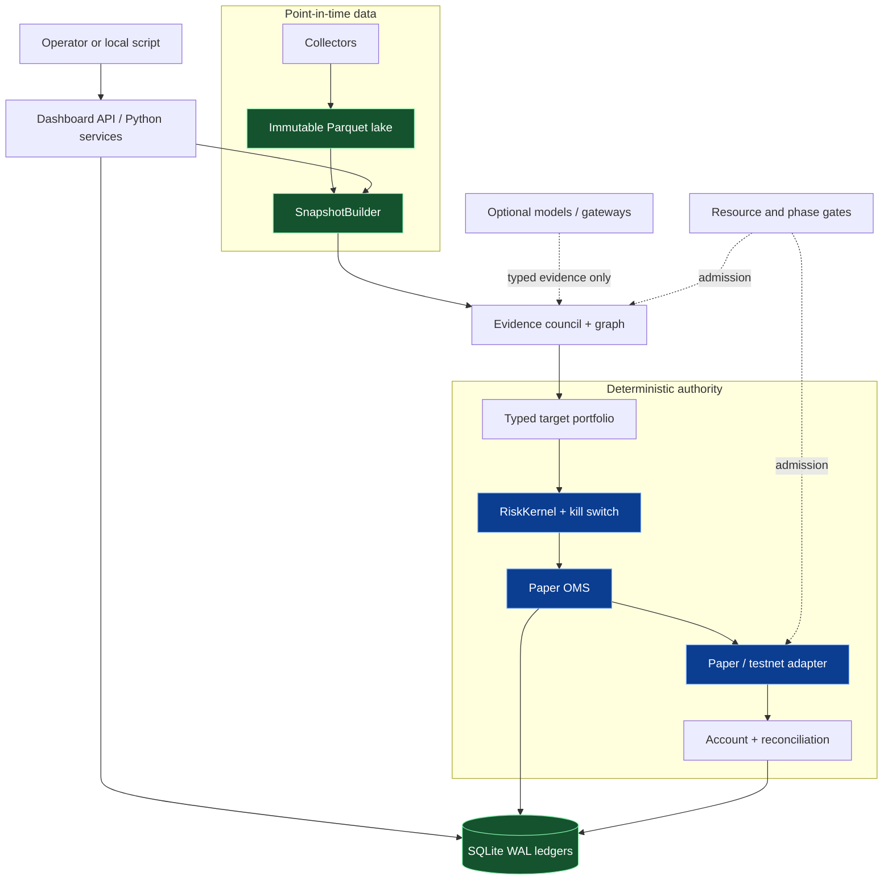

<p align="center">
  
</p>

<h1 align="center">AdvisorAI V3</h1>

<p align="center">
  A federated research and paper-trading system with one deterministic safety and execution spine.
</p>

> [!IMPORTANT]
> This repository is paper/testnet first. The normal runtime and transition configuration reject live environments, while the Phase 10 guard requires explicit, time-bounded evidence and human approval. Installing an optional integration or model extra does not grant authority.

## What this is

AdvisorAI V3 turns point-in-time market data and independent research evidence into an auditable target portfolio, then evaluates that target through deterministic risk and paper-execution controls. The project is designed for a single owner-operator on a resource-bounded workstation, with local Parquet/DuckDB/Polars analysis and SQLite WAL ledgers for operational truth.

The central boundary is deliberately simple:

```text
data snapshot → independent evidence → target portfolio → RiskKernel → paper OMS → reconciliation
```

Models, agents, gateways, and the dashboard can propose or explain. They do not write ledgers directly, loosen risk limits, or become an order authority.

## Why this architecture

The system addresses two failure modes that are easy to hide in an AI-heavy trading prototype:

1. **Bad evidence can look like consensus.** Evidence carries source family, origin, availability, expiry, ancestry, and factor-family metadata. The evidence graph discounts syndication and shared model ancestry before it evaluates a quorum.
2. **A plausible recommendation can bypass controls.** A recommendation becomes a typed target portfolio, not an order. The deterministic `RiskKernel`, order state machine, idempotent ledger, venue adapter, and reconciliation service own the paper-trading boundary.

This makes the repository useful as a safety-oriented foundation and testbed. It is not a claim of live trading readiness or investment performance.

## Current capabilities

| State | Capability | Where it lives |
| --- | --- | --- |
| Implemented | Strict, versioned Pydantic artifacts for snapshots, evidence, forecasts, targets, risk decisions, orders, fills, reconciliation, model cards, and capability cards | [`src/advisorai/contracts`](src/advisorai/contracts) |
| Implemented | Point-in-time-safe local data lake with immutable Bronze/Silver/Gold artifacts and manifest verification | [`src/advisorai/lake`](src/advisorai/lake) |
| Implemented | SQLite WAL ledgers, idempotency, event outbox, incidents, traces, recovery rebuilds, and content-addressed configuration bundles | [`src/advisorai/ledger`](src/advisorai/ledger), [`src/advisorai/config`](src/advisorai/config) |
| Implemented | Mission routing, elastic evidence council, independence gate, target portfolio construction, and deterministic risk evaluation | [`src/advisorai/agents`](src/advisorai/agents), [`src/advisorai/api/service.py`](src/advisorai/api/service.py), [`src/advisorai/execution`](src/advisorai/execution) |
| Implemented | Paper venue adapter, order lifecycle, ambiguous-ack reconciliation, account projection, attribution/TCA, and kill switch | [`src/advisorai/execution`](src/advisorai/execution) |
| Implemented | React operator console with an optional FastAPI API, synthetic fixture mode, ledger projections, guarded paper controls, and protected password/TOTP mode | [`dashboard`](dashboard), [`src/advisorai/api/dashboard.py`](src/advisorai/api/dashboard.py) |
| Implemented | Phase admission records, model lifecycle, connector lifecycle, and read-only capability lifecycle | [`src/advisorai/gates.py`](src/advisorai/gates.py), [`src/advisorai/models/authority.py`](src/advisorai/models/authority.py), [`src/advisorai/capabilities`](src/advisorai/capabilities) |
| Gated / experimental | Optional PydanticAI/Graph, Prefect, Hamilton, LiteLLM, NautilusTrader, model runtimes, public-data qualification, and paper/testnet connector smoke tests | [`pyproject.toml`](pyproject.toml), [`docs/plans`](docs/plans), [`docs/runbooks`](docs/runbooks) |
| Not enabled | Live-capital operation, unrestricted browser/agent authority, automatic model promotion, and the planned Alpha Team extension | [`docs/concepts/status.md`](docs/concepts/status.md) |

## Architecture at a glance



The detailed current-implementation view, ownership table, and target process boundaries are in [Architecture](docs/concepts/architecture.md). The end-to-end lifecycle is in [Execution model](docs/concepts/execution-model.md).

## Quick start

The base environment is enough to run the deterministic test suite and inspect the configuration. No credentials, external services, or network calls are needed.

```bash
uv sync --group dev
PYTEST_DISABLE_PLUGIN_AUTOLOAD=1 uv run pytest -q
uv run ruff check .
```

To run the local operator console with its synthetic paper snapshot:

```bash
./scripts/launch_dashboard.sh
```

Open <http://localhost:5173>. The launcher starts the API on `127.0.0.1:8787`, waits for `/api/v1/health`, starts Vite, and stops both processes on Ctrl-C. Synthetic values are explicitly labelled in the UI; they are not trading evidence.

For a guided first run, see [Getting started](docs/getting-started/quickstart.md). For protected local/LAN operation, see [Operator console](docs/guides/operator-console.md).

## A representative API check

With the launcher running, the health endpoint is intentionally small and unauthenticated:

```bash
curl http://127.0.0.1:8787/api/v1/health
```

```json
{"status":"ok","environment":"paper_testnet"}
```

The dashboard API does not expose a live-order endpoint. Its command contract is limited to paper halt/resume, mode changes, configuration proposals/rollback, and data refresh; sensitive commands require explicit confirmation and a recent step-up token in protected mode. See the [API reference](docs/reference/api.md).

## Screenshots

These screenshots are captured from the current dashboard in local development mode. They use the repository's explicit synthetic fixture, not live or simulated performance claims.

| Surface | What it shows |
| --- | --- |
| [Overview](docs/assets/screenshots/dashboard-overview-synthetic.png) | Paper/testnet state, sealed live gate, risk summary, mission runway, data quality, service health, and audit activity |
| [Missions](docs/assets/screenshots/dashboard-missions-synthetic.png) | Evidence counts, dissent, expiry, confidence, and abstention before risk evaluation |
| [Risk & limits](docs/assets/screenshots/dashboard-risk-synthetic.png) | Deterministic limit utilization and the non-negotiable control boundary |


## System components

| Component | Responsibility |
| --- | --- |
| Contracts | Immutable, hashable hand-off artifacts and authority deny-lists |
| Collectors and data lake | Raw response spooling, source metadata, point-in-time observations, quality, failover, and local immutable storage |
| Mission and evidence plane | Mode admission, role scheduling, typed evidence, independence checks, dissent, and expiring decision bundles |
| Deterministic trading plane | Portfolio construction, RiskKernel, order state machine, paper/testnet transport, account state, reconciliation, and TCA |
| Control and operations | Resource leases, phase gates, incidents, traces, recovery, model/connector/capability lifecycle, and configuration activation |
| Operator console | Read-only projections plus narrowly scoped, audited paper controls; never canonical trading state |

## Repository layout

```text
advisorai-v3/
├── src/advisorai/      Python contracts, services, adapters, controls, and runtime
├── configs/            Reviewed V3-Core, risk, source, model, resource, and mode YAML
├── dashboard/          React/TypeScript operator console
├── scripts/            Acceptance, qualification, smoke, evidence, and launch commands
├── tests/              Contract, unit, integration, capability, gate, and recovery coverage
├── docs/               Navigable guides, concepts, references, plans, and runbooks
├── model_runtimes/     Isolated optional runtime requirement fragments
├── services/           Service-boundary manifest documentation
├── artifacts/          Ignored local evidence output; not repository source of truth
├── DESIGN.md           Dashboard design system and product visual constraints
└── PRODUCT.md          Product intent and operator context
```

The service registry describes intended ownership/process boundaries; it is not a process supervisor or deployment manifest. Run `uv run python -m advisorai.services` to print its dependency order.

## Documentation

Start with the [documentation index](docs/README.md), or jump directly to:

- [Installation](docs/getting-started/installation.md) · [Quickstart](docs/getting-started/quickstart.md) · [Configuration](docs/getting-started/configuration.md)
- [Architecture](docs/concepts/architecture.md) · [Data flow](docs/concepts/data-flow.md) · [Execution model](docs/concepts/execution-model.md) · [Project status](docs/concepts/status.md)
- [Operator console](docs/guides/operator-console.md) · [CLI reference](docs/reference/cli.md) · [API reference](docs/reference/api.md) · [Configuration reference](docs/reference/configuration.md)
- [Development setup](docs/development/setup.md) · [Testing](docs/development/testing.md) · [Extending the system](docs/development/extending.md) · [Debugging](docs/development/debugging.md)
- [Phase plans](docs/plans/README.md) · [Operational runbooks](docs/runbooks) · [Architecture decisions](docs/decisions)

## Development and testing

The canonical developer loop is:

```bash
uv sync --group dev
PYTEST_DISABLE_PLUGIN_AUTOLOAD=1 uv run pytest -q
uv run ruff check .
cd dashboard && npm ci && npm run build
```

The phase runner starts a fresh pytest process per phase and stops at the first failure:

```bash
PYTEST_DISABLE_PLUGIN_AUTOLOAD=1 uv run python scripts/verify_acceptance.py
PYTEST_DISABLE_PLUGIN_AUTOLOAD=1 uv run python scripts/verify_acceptance.py --phase 2
```

Local tests prove executable controls. They do not manufacture timed Phase 0/7 evidence or human Phase 10 approval. See [Testing](docs/development/testing.md) and [Project status](docs/concepts/status.md).

## Safety, security, and scope

- Point-in-time contracts reject observations that were not available at the decision cutoff.
- Stale, disagreed, expired, or otherwise invalid inputs can cause abstention or deterministic risk rejection.
- The AI gateway and capability broker deny order, risk-limit, credential, and live-deploy authority.
- Paper runtime and transition settings are restricted to `paper`, `testnet`, or `paper_testnet`.
- Protected dashboard mode uses password + TOTP, short-lived sessions, CSRF binding, step-up authentication, idempotency, and audit receipts; TLS and network exposure remain deployment responsibilities.
- Secrets are parsed from the ignored `secrets.env` inventory without shell execution and delivered by allowlisted credential scope.

Read [SECURITY.md](SECURITY.md) for the security model and [Credential scopes](docs/runbooks/credential-scopes.md) for the adapter boundary.

## Contributing

Before changing a boundary, read [CONTRIBUTING.md](CONTRIBUTING.md), the relevant concept document, and the closest tests. Keep production behavior unchanged for documentation-only work, do not commit credentials or ignored artifacts, and update docs when an interface or gate changes.

## License

AdvisorAI's original source code is proprietary and All Rights Reserved. Third-party software, model checkpoints, datasets, and provider data retain their respective licenses and terms. See [`LICENSE`](LICENSE), [`THIRD_PARTY_NOTICES.md`](THIRD_PARTY_NOTICES.md), and the [licensing audit](docs/compliance/license-audit.md).

This is a source-visible proprietary repository, not an open-source license. Public GitHub hosting remains subject to GitHub's platform terms; use a private repository when strict source access is required. A proprietary source license does not by itself clear a future wheel, container, model bundle, cached-data release, or commercial distribution.
