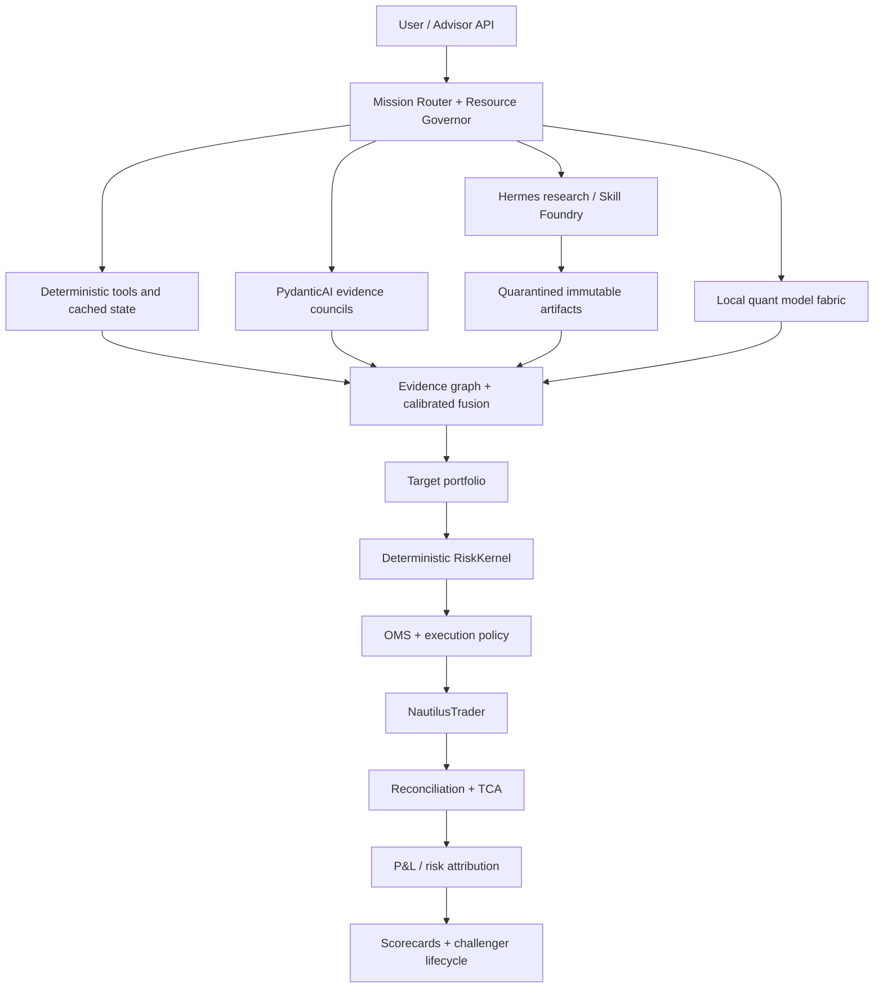

# AdvisorAI V3 — final architecture and implementation plan

**Plan date:** 2026-08-04  
**Status:** final target architecture plus staged build plan  
**Target machine:** one Windows/WSL2 laptop, Intel i7, 16 GB host RAM, approximately 11 GB WSL RAM, RTX 4060 8 GB VRAM  
**System goal:** one user-facing Advisor composed of deterministic trading services, independent quantitative and agentic analysts, point-in-time data, professional portfolio/risk/execution controls, durable memory, a sandboxed research and Skill Foundry, and controlled learning.

This document supersedes the earlier AdvisorAI from-zero, federated V2, and interim V3 build recommendations. The longer architecture dossier remains useful as research evidence; this is the implementation authority.

---

## 1. Final decision

Build AdvisorAI V3 as a **federated system with one interface and many elastic specialists**.

It is not one LLM, one agent, or one process. It is also not dozens of permanently running agents. Logical roles are cheap definitions; physical work is admitted only when it adds expected decision value within time, RAM, GPU, and API budgets.

The central rule is:

> No forecast becomes a trade until it survives independent evidence checks, portfolio construction, deterministic pre-trade risk, realistic cost/capacity analysis, execution controls, reconciliation, and post-trade attribution.

The second rule is:

> More agents count only when they add a distinct source, method, model, implementation, or failure mode. Repeated LLM opinions are not independent evidence.

### 1.1 Canonical component ownership

| Responsibility | Canonical owner | Important boundary |
|---|---|---|
| User missions and operating mode | Advisor API + deterministic Mission Router | an LLM may advise, but policy selects the mode and budget |
| Typed agents and evidence fusion | PydanticAI + Pydantic Graph | agents cannot submit orders or relax limits |
| Deep research, Python work, environments and skills | Hermes Agent, on demand and sandboxed | no broker credentials, order tools, or live-repository mutation |
| Durable schedules, retries, backfills and experiments | Prefect | no market-event or order ownership |
| Feature and label dependencies | Hamilton | no orchestration or execution ownership |
| Live market events, replay and execution | NautilusTrader | no LLM, browser, or warehouse query in the hot path |
| Portfolio and pre-trade safety | AdvisorAI deterministic Portfolio Constructor + RiskKernel sharing authoritative trading state | one veto path; no competing agent risk engine |
| Orders, fills and reconciliation | deterministic OMS ledger + Nautilus adapters | every transition is idempotent and auditable |
| Local analytical compute | small time-series, finance NLP, tabular and calibration workers | forecasts are evidence, never direct orders |
| General reasoning models | replaceable `ModelGatewayPort` using APIs | exact provider/model/route is recorded |
| Active data | local Parquet + DuckDB + SQLite WAL ledgers | cloud drives are never compute truth |
| Cold archive | `rclone crypt` through `ArchiveBackend` | OmniCloud is optional visibility/allocation, not authority |

### 1.2 Final treatment of contested components

| Component | Final position |
|---|---|
| Hermes Agent | **Adopt** as the on-demand Research/Builder/Skill Runtime |
| Paperclip | defer; retain only an integration port for a future multi-user/multi-organization deployment |
| LiteLLM | provisional gateway baseline after a Phase-0 test |
| OmniRoute | quarantined gateway challenger; admit only if its free-route value survives stability, privacy and identity tests |
| OmniCloud | optional archive UI/allocator after restore tests; never required |
| TradingAgents | offline shadow council after V3-Core is stable |
| RD-Agent/Qlib | isolated research challengers; do not own production features, risk, backtests or execution |
| LEAN | selected cross-engine oracle cases only |
| VectorBT | rapid research screen, never the realism gate |
| NautilusTrader | canonical event replay and execution engine |
| Local general LLM | exclude from V3 baseline; reserve GPU for quant models |
| Browser-use | discovery/repair only; convert successful work into deterministic collectors |

---

## 2. End-to-end architecture



The authoritative decision chain is:

**validated snapshot → independent evidence → calibrated forecasts → target portfolio → risk decision → execution plan → orders/fills → reconciliation → TCA/attribution → controlled learning**

Every hand-off is a typed, versioned artifact. Large data stays in Parquet/object artifacts; queues and agents pass IDs rather than copied payloads or chat transcripts.

---

## 3. Operating modes and resource governance

### 3.1 Mission modes

| Mode | Use | Physical activity |
|---|---|---|
| **Trade/Fast** | market state, alerts, monitoring, deterministic calculations | hot path, collectors, ledgers, cached/CPU forecasts; no Hermes or browser |
| **Standard** | ordinary recommendation or portfolio review | 4–8 logical roles, 2 API calls initially, one GPU forecast wave if useful |
| **Deep** | high-value research, novel event, unresolved disagreement | expanded council, pinned API routes, challengers and optional Hermes mission |
| **Builder** | missing collector, model adapter, test, tool or skill | Hermes + isolated task environment + reviewers; trading services protected |
| **Recovery** | stale data, provider failure, reconciliation or operational incident | deterministic runbook first; Hermes may diagnose offline, never control live orders |

### 3.2 Admission and early stopping

Run work in waves:

1. deterministic data-quality, freshness, limit and baseline checks;
2. cheapest high-information analysts/models;
3. uncertainty, evidence-dependency and dissent calculation;
4. stop if the evidence gate is met;
5. otherwise activate an independent source, model, skeptic or program;
6. expire late results at the decision cutoff instead of silently merging them.

The scheduler ranks optional work by:

**expected uncertainty reduction × decision value ÷ latency × resource cost × API cost**

### 3.3 Laptop envelopes

The Resource Governor measures operating-system reality; agents never self-report resource availability.

| Mode | WSL RAM ceiling | GPU rule |
|---|---:|---|
| Trade/Fast | 6.5 GB | normally idle; one frozen, pre-approved inference model only |
| Standard | 8.0–8.5 GB | one micro-batched inference worker |
| Deep/Builder | 8.5–9.0 GB | one model or one isolated build/test job |
| Browser | 7.5–8.0 GB | pause GPU work unless measured headroom passes |
| Train | 8.5–9.0 GB | exclusive GPU lease; browsers and Hermes off |
| Archive | 6.5 GB | no GPU |

Always preserve 1.5–2 GB of WSL headroom. Swap is emergency protection, not normal capacity.

Initial concurrency caps:

- remote LLM calls: 2 Standard, up to 4 Deep;
- active Hermes: one coordinator and one subagent; raise to two subagents only after benchmarks;
- browser: one page/context-heavy job;
- heavy DuckDB queries: two;
- CPU-bound Python processes: one or two;
- GPU jobs: one global lease;
- backtests/trainers: one heavy job at a time.

Load-shedding order is archive → browser → Hermes/Skill Foundry → low-priority research → training/backtests → optional model challengers → noncritical collectors. Never shed account/order/fill state, reconciliation, risk, kill switch, or critical raw-market persistence.

---

## 4. Data system

### 4.1 Point-in-time contract

Every observation records, when applicable:

- entity and instrument identity;
- event/effective time;
- source publication time;
- first externally available time;
- AdvisorAI ingestion time;
- source revision/vintage and superseded record;
- raw artifact hash and parser version;
- source family, origin and syndication chain;
- quality, delay and intended-use grade.

Backtests and agent missions read immutable snapshots with an explicit `as_of` cutoff. Revised macro data, filings, news, corporate actions and congressional disclosures must never appear before their first-available time.

### 4.2 Storage tiers

| Tier | Technology | Contents |
|---|---|---|
| Live spool | append-only local files + SQLite outbox | market messages, order/fill events, uncommitted writes |
| Bronze | immutable partitioned Parquet | exact raw source payloads and manifests |
| Silver | Parquet + Hamilton transforms | normalized point-in-time entities and observations |
| Gold | Parquet | features, labels, frozen research/trading snapshots |
| Ledgers | SQLite WAL | missions, models, capabilities, risks, orders, fills, incidents, archive and approvals |
| Query | DuckDB + Polars/Arrow | local analytics without a permanent database server |
| Cold | rclone-crypt encrypted bundles | closed immutable partitions, model/experiment/recovery bundles |

Plain manifest-managed Parquet is the baseline. DuckLake is admitted only if its measured catalog/versioning value exceeds its operational cost.

### 4.3 Source program

Sources are classified as **execution-grade**, **research-grade**, or **context-only**. No young or free aggregator is the sole source for a live-capital decision.

Priority families:

| Family | Initial/target sources | Intended use |
|---|---|---|
| Crypto market | native venue REST/WebSocket; CCXT for backfill/cross-venue normalization | bars, trades, books, funding and open interest |
| Equities | broker/paper feed, official exchange/calendar/corporate-action references, London Strategic Edge as audited corroboration | daily/intraday research and later paper execution |
| Corporate/fundamental | SEC EDGAR, company facts, financial statement/notes and DERA bulk sets, official investor relations | point-in-time fundamentals, filings and events |
| Macro | FRED/ALFRED first; BLS, BEA, Treasury, central-bank sources as needed | vintaged releases, surprises and regimes |
| News | official/company RSS, GDELT, direct origin pages | event, novelty, source reliability and reaction |
| Derivatives | Deribit public data for crypto; broker/exchange data where licensed | IV, skew, term structure, Greeks, basis and liquidity |
| Prediction markets | Kalshi and Polymarket public data | calibrated event probabilities and disagreement |
| Government/alternative | House/Senate disclosures, Capitol Trades as verifier, contracts, patents and trials | delayed contextual evidence only |
| Research benchmarks | Numerai, free LOBSTER samples, SSRN/papers | pipeline/model validation, never assumed production truth |

OpenBB may normalize selected research feeds; it is not a source of truth itself. QuantLib supplies pricing/risk mathematics when derivatives enter scope.

### 4.4 Acquisition ladder

Use the cheapest deterministic compliant method that works:

1. official bulk download, API or WebSocket;
2. RSS/Atom or stable HTTP;
3. deterministic parser/Scrapy;
4. Playwright for JavaScript pages;
5. Camoufox only for public pages where ordinary browser automation is rejected and collection is permitted;
6. Hermes/browser-use for discovery or repair;
7. convert stable discoveries into a tested deterministic collector.

Respect access terms, robots/rate rules and authentication boundaries. Web content is untrusted data: strip active content, quarantine downloads, block prompt-injected instructions, and never expose secrets or order tools to a browser agent.

---

## 5. Local quantitative and API-AI model fabric

### 5.1 Work split

| Work | Runtime |
|---|---|
| planning, research, tool use, debate and synthesis | API LLMs through `ModelGatewayPort` |
| forecasting, anomaly detection, classification, tabular ML and calibration | local CPU/GPU workers |
| risk, portfolio math, execution policy, ledgers and gates | deterministic code only |

The gateway records the concrete provider/model, fallback chain, schema mode, latency, tokens, cost estimate, prompt/tool versions and gateway version. High-value evaluation runs use pinned routes, not opaque automatic routing.

### 5.2 Initial local roster

| Model family | Role | Default state |
|---|---|---|
| naive/drift/seasonal, AR/linear and volatility baselines | mandatory falsification and fallback | always included |
| LightGBM | strong tabular baseline and feature interactions | core |
| TTM-R2 | ultra-light CPU probabilistic forecasting candidate | core candidate |
| TSPulse | anomaly, imputation, similarity and regime/integrity features | core candidate; not treated as a price forecaster |
| Chronos-2-small | general probabilistic/covariate GPU forecast | choose in Phase 0 |
| Kronos-mini/small | finance/OHLCV-specific forecast and representation | compete with Chronos; not automatically co-resident |
| TabPFN-TS | independent tabular formulation | Deep-mode challenger |
| TiRex/TTM-R3/newer models | benchmark quarantine | no baseline dependency |
| FinBERT-family classifier | high-volume news triage on CPU | core candidate |
| small CPU embedder | retrieval candidate after lexical baseline | optional; FTS5 remains available |

One GPU worker loads one family at a time and micro-batches across assets. A different checkpoint name is not independent evidence if it shares the same dataset, preprocessing, or architecture ancestor.

### 5.3 Forecast contract and evaluation

Each `ForecastArtifact` includes:

- asset/universe, cutoff, horizon and target;
- point/quantile/distribution forecast;
- confidence and abstention state;
- model/data/feature/code hashes;
- calibration version and training cutoff;
- resource/latency measurements;
- known support limits and failure regimes.

Evaluate decisions, not just price error:

- probabilistic calibration, interval coverage, Brier/log score where relevant;
- rank IC and stability for cross-sectional work;
- directional/return utility after costs;
- turnover, drawdown, tail loss and capacity;
- marginal value over naive/linear/LightGBM baselines;
- error correlation and regime-specific failure.

A TSFM is removed if it does not add stable net utility or useful calibrated uncertainty.

---

## 6. Federated intelligence and multi-factor checking

### 6.1 Logical desks

The target catalog includes:

- market/technical and time-series analysts;
- microstructure and liquidity analysts;
- fundamental/accounting/filing analysts;
- macro/cross-asset/regime analysts;
- news/event/sentiment/source-reliability analysts;
- crypto/on-chain/DeFi/prediction-market analysts;
- portfolio, factor-risk, margin, scenario and execution analysts;
- independent verifiers, skeptics, base-rate judges and red-team reviewers;
- research, model, data, skill and reproducibility specialists.

These are definitions with typed contracts and scorecards, not resident processes.

### 6.2 Evidence independence

Every claim records source artifacts, source-family/origin, timestamps, transformation lineage, model/provider/prompt/skill/code versions, assumptions, uncertainty, expiry and invalidation conditions.

The fusion graph discounts shared ancestry:

- syndicated copies of one article count as one origin;
- RSI, MACD and moving averages from one price series are one factor family;
- two agents using the same summary/model are correlated;
- several TSFMs using the same bars remain data-correlated;
- a second backtest engine is valuable only for implementation reconciliation, not as new market evidence.

Minimum gates:

| Decision | Required evidence |
|---|---|
| Informational answer | one authoritative source or two credible independent research sources |
| Material research conclusion | two source families plus a deterministic check where possible |
| Strategy candidate | economic rationale, baseline, two implementations, past-only validation, event replay and statistical audit |
| Paper trade | at least three genuinely different factor families, two source families, no-trade comparison and deterministic risk pass |
| Live-capital or limit change | all paper requirements, independent review, current reconciliation, hard risk pass and explicit human approval |

The final recommendation always exposes consensus, strongest dissent, missing evidence, confidence, expiry, and what would invalidate it.

### 6.3 Agent scorecards

Track factual/citation precision, calibration, abstention quality, contradiction detection, forecast utility, marginal value, latency, API cost and failure rate by role, model route, asset, horizon and regime. Poor agents lose routing weight and return to quarantine; no prompt is promoted from anecdotal success.

---

## 7. Professional trading stack

### 7.1 Research and validation

Every alpha follows:

**hypothesis → economic rationale → point-in-time dataset → deterministic features/labels → simple baseline → past-only test → neutralization/exposure analysis → purged walk-forward validation → realistic costs/capacity → regime/stress holdout → independent implementation → Nautilus replay → shadow/paper → controlled promotion**

Required protections include survivorship and delisting handling, corporate actions, vintages/revisions, clock/calendar correctness, embargo/purge where labels overlap, multiple-testing control, parameter sensitivity, benchmark/no-trade comparison and reproducible code/data/model hashes.

VectorBT or direct NumPy/Polars performs fast falsification. NautilusTrader is the realism gate. LEAN may reconcile a few promoted cases after V3-Core, but is not a permanent second production engine.

### 7.2 Portfolio construction

Forecasts become a cost-aware `TargetPortfolio`, not ad-hoc buy/sell messages.

The constructor accounts for:

- expected return distribution after costs;
- covariance/factor exposures and risk contribution;
- current positions, cash, netting and correlated bets;
- liquidity, capacity, turnover and signal decay;
- concentration, leverage, margin and scenario limits;
- minimum trade/no-trade bands and hysteresis.

Compare every optimized portfolio with no-trade, equal weight, inverse volatility, simple risk-budget and the prior champion. Complexity is admitted only when it improves stable out-of-sample net utility.

### 7.3 Deterministic risk hierarchy

`RiskPolicy` is versioned, reviewed, immutable during a decision, and auditable. The RiskKernel independently recomputes from authoritative account/order/market state and may only approve, reduce or reject.

Hard limits cover:

- account capital and daily/rolling loss;
- gross/net exposure, leverage and drawdown;
- portfolio/strategy/factor/sector/currency concentration;
- instrument position, volatility, liquidity and capacity;
- order notional, price collars, size, rate and duplication;
- turnover, spread, slippage and expected impact;
- cash, margin, collateral, funding, borrow and liquidation buffer;
- venue/counterparty exposure and health;
- stale/missing/disagreed data and clock/session state;
- model drift, unsupported regime and expired forecasts;
- operational health, reconciliation and kill-switch state.

Risk analytics include volatility, beta/factor exposure, robust covariance, VaR as a diagnostic, expected shortfall, liquidity/capacity, margin/liquidation and historical/synthetic/reverse stress. VaR alone is never a safety guarantee.

Agents may recommend tighter limits. They cannot loosen limits, change approval authority, or override a veto.

### 7.4 OMS, execution and recovery

Canonical order states are:

**created → risk-approved → routed → acknowledged → partially filled → filled / cancel-pending / cancelled / rejected / expired → reconciled**

Every parent intent and child order has an idempotency key. Ambiguous network outcomes trigger venue/broker reconciliation, never blind resubmission.

Execution policies are deterministic and choose venue/order type/time-in-force/urgency from spread, depth, volatility, impact, fill probability, latency, fees and signal decay. Begin with simple immediate or passive-limit policies; add TWAP/VWAP/POV only after measured need.

The system must cancel, exit, reconcile and enforce risk with API LLMs, Hermes, browsers, gateways and research workers all stopped.

### 7.5 Post-trade truth

The authoritative ledger reconciles orders, fills, positions, cash, fees, funding, borrow, realized/unrealized P&L, marks, FX, corporate actions and transfers.

Transaction-cost analysis records implementation shortfall, spread, fees, market impact, delay, opportunity cost, fill ratio, adverse selection and venue performance.

Attribution reconciles total results across:

- data and forecast;
- factor/asset allocation and selection;
- portfolio construction and risk overlays;
- execution and financing;
- regime, capacity and unexplained residual.

An unexplained residual is an incident, not a rounding bucket.

### 7.6 Stress and incidents

Required scenarios include price gaps, volatility jumps, correlation breakdown, spread/depth collapse, halted/delisted instruments, funding and liquidation cascades, stablecoin depeg, venue/API outage, withdrawal freeze, counterparty failure, stale/duplicated data, clock drift and duplicate/partial-fill recovery.

Every significant incident has severity, owner, runbook, timeline, evidence, containment, reconciliation, root cause, corrective test and rollback/postmortem links.

---

## 8. Hermes Research and Skill Foundry

Hermes is valuable because its Python-native programmatic execution, persistent skills, profiles, subagents and isolated environments fit the slow research/build side of AdvisorAI. Its mutability is also why it cannot be trusted inside the trading boundary.

### 8.1 Allowed outputs

Hermes may produce only quarantined artifacts such as:

- `ResearchBundle` with sources, claims, code and unresolved questions;
- `CandidateStrategy` with rationale and an experiment specification;
- `CollectorCandidate` or `ModelAdapterCandidate`;
- `CapabilityBundle` with typed interface, tests and permissions;
- `EnvironmentManifest` with image/lock/model/data hashes;
- failure analysis, migration proposal or recovery runbook draft.

All outputs pass Pydantic schema validation, security review, reproducibility tests, frozen-data evaluation and independent review before entering the main registry.

### 8.2 Isolation policy

- Deep, Builder or offline Recovery mode only;
- no broker/exchange trading credentials;
- no `submit_order`, limit-change or live-deployment tool;
- one task directory/container per mission;
- scoped read-only data snapshots by default;
- allowlisted network/secrets only when the task requires them;
- CPU/RAM/wall-time/process limits;
- immutable base image plus task overlay;
- record Git commit, `uv.lock`, container digest, dataset/model revisions, skill hashes, seeds and tool versions;
- export persistent Hermes skills into AdvisorAI `CapabilityBundle`s; Hermes memory is never the only copy or authority.

### 8.3 Capability lifecycle

**gap → scout → pin → inspect → sandbox → wrap/build → contract tests → adversarial/security tests → performance benchmark → shadow → active-read → active-write-limited → deprecated**

Automatic promotion stops at active-read. Live-capital write authority is never generated or granted automatically.

The Capability Broker exposes only a small permission- and resource-filtered set of relevant tools to each agent. Every `CapabilityCard` declares its version, inputs/outputs, authority, secrets/network needs, resource envelope, latency, determinism, source grade, failure modes, tests, score and lifecycle state.

---

## 9. Memory, observability and controlled learning

### 9.1 Memory layers

| Memory | Authority/use |
|---|---|
| working/checkpoint state | one mission, resumable but not long-term truth |
| evidence store | immutable raw/normalized artifacts and dependency graph |
| episodic ledger | missions, decisions, approvals, failures and incidents |
| semantic retrieval | FTS5 first; optional local embeddings for recall, never authority |
| experiment ledger | hypotheses, trials, metrics and complete reproduction hashes |
| model/agent scorecards | routing, calibration, drift and retirement |
| trading ledger | authoritative proposals, risk decisions, orders, fills and accounting |
| capability registry | tested tools, skills, models, collectors and permissions |

Summaries always link to evidence IDs. New conclusions supersede rather than overwrite history. Negative results and failed tools are retained.

### 9.2 Observability

Write structured traces and metrics to SQLite/Parquet and expose lightweight dashboards. Monitor data freshness/quality, API routes, model calibration/drift, risk usage, queue depth, process/RAM/VRAM, order/fill health, TCA, P&L attribution and archive restore state.

Do not add Prometheus/Grafana until the single-node dashboards become an observed bottleneck.

### 9.3 Learning boundaries

Strategies/models follow:

**idea → reproducible → screened → statistically validated → event replayed → stress passed → shadow → paper → human-approved limited live → champion → retired**

Models, agents, sources and skills learn through challengers and scorecards. Production code, limits and live authority never self-modify. Realized outcomes update calibration only after the horizon closes and the outcome was actually available.

---

## 10. Process and repository design

### 10.1 Always-on Trade/Fast services

- `advisor-api`: UI/API, mission routing, approvals and status;
- `market-node`: Nautilus strategies, portfolio state, RiskKernel, OMS and adapters;
- `collector-node`: critical streams/polling and raw spooling;
- `data-writer`: manifests, validation and bounded compaction;
- `account-ledger`: positions, cash, fees, funding, margin and reconciliation;
- `resource-governor`: measured leases, quotas, admission and load shedding.

### 10.2 On-demand services

- `agent-fabric`: PydanticAI councils and fusion;
- `model-gateway`: one active LiteLLM/OmniRoute/direct adapter;
- `quant-worker`: one CPU/GPU quant inference process;
- `finance-nlp-worker`: CPU classifier/embedding batches;
- `risk-analytics-worker`: covariance, factors, capacity and scenarios;
- `tca-attribution-worker`: post-trade analyses;
- `prefect-worker`: durable data/research flows;
- `hermes-worker`: sandboxed research and Skill Foundry;
- `browser-worker`: one escalated browser job;
- `archive-worker`: rclone-crypt transfer/restore.

Use loopback/Unix sockets and typed HTTP first. Durable cross-process hand-offs use SQLite outbox rows plus artifact IDs. Keep an `EventBusPort`; add NATS only when profiling or a second machine proves it necessary.

### 10.3 Repository layout

```text
advisorai-v3/
  pyproject.toml
  uv.lock
  configs/
    modes/ resources/ sources/ agents/ models/ risk/ execution/
  src/advisorai/
    contracts/
    api/
    mission_router/
    resources/
    collectors/{api,rss,http,browser}/
    lake/{bronze,silver,gold,snapshots,archive}/
    identity/
    features/
    labels/
    models/{forecasting,finance_nlp,tabular,calibration}/
    agents/{roles,councils,fusion,evals}/
    portfolio/
    risk/{limits,factors,scenarios,margin_liquidity}/
    execution/{oms,policies,reconciliation,tca}/
    attribution/
    research/{native,challengers}/
    capabilities/{registry,broker,skills,importers}/
    memory/
    observability/
  services/
    gateways/{litellm,omniroute,direct}/
    hermes/
    archive/{rclone_crypt,omnicloud_optional}/
  tests/
    contracts/ point_in_time/ data/ models/ agents/ independence/
    portfolio/ risk/ replay/ execution/ reconciliation/ chaos/
    security/ resources/ recovery/
  artifacts/
  docs/{decisions,models,sources,capabilities,runbooks,postmortems}/
```

Dependency groups keep Trade mode from importing browser, Hermes, PyTorch training, RD-Agent, Qlib, LEAN or other research-only packages.

---

## 11. Build program and gates

Expansion is gate-driven, not calendar-driven.

### Phase 0 — freeze contracts and run bake-offs

- write architecture decision records and core Pydantic contracts;
- benchmark direct API, LiteLLM and OmniRoute on identical typed/tool calls, route identity, privacy, idle/active RSS, 24-hour stability and failure handling;
- benchmark TTM-R2, TSPulse, Chronos-2-small, Kronos-mini/small and TabPFN-TS against baselines for latency/RAM/VRAM/utility;
- benchmark Nautilus adapters/replay, Prefect and Hamilton overhead;
- benchmark plain Parquet manifests versus DuckLake;
- benchmark one Hermes coordinator/one subagent in an isolated environment;
- test rclone-crypt upload, verification and restore from two providers.

**Gate:** selected components fit the resource envelopes; exact model/source versions are reproducible; no unexplained 24-hour memory growth.

### Phase 1 — safety, data truth and resource skeleton

- implement Snapshot, Evidence, Forecast, TargetPortfolio, RiskPolicy/Decision, ExecutionPlan, Order/Fill, Reconciliation, Attribution, ModelCard, AgentRun and Capability contracts;
- implement Bronze/Silver/Gold, time/origin rules, instrument identity and manifests;
- create account/order/mission/model/capability/incident ledgers;
- implement Resource Governor, structured tracing and immutable config/version bundles.

**Gate:** Bronze rebuild is deterministic; leakage fixtures fail; idempotency and config rollback pass.

### Phase 2 — deterministic paper-trading core

- one venue adapter and raw replay;
- Nautilus event pipeline;
- account/position/cash ledger;
- minimal target-portfolio constructor;
- RiskKernel, kill switch and OMS state machine;
- paper/testnet order lifecycle, reconciliation and simple TCA.

**Gate:** duplicate, ambiguous acknowledgement, partial fill, reconnect, stale data, venue outage, price collar and kill-switch fixtures fail safely with every ledger reconciled.

### Phase 3 — V3-Core data spine

- native venue trade/book/bar/funding data;
- Deribit contextual derivatives data;
- official/company RSS plus GDELT event/news feed;
- optional audited LSE cross-check that cannot become sole authority;
- quality, freshness, gaps, origin, revision and availability-time dashboards.

**Gate:** immutable replay, source lineage and cross-source disagreement handling pass.

### Phase 4 — quantitative baseline council

- naive/statistical and LightGBM baselines;
- TTM-R2 and TSPulse CPU wave;
- choose **one** initial GPU family: Chronos-2-small or Kronos-mini;
- common forecast contract, rolling calibration and abstention;
- fast screen plus Nautilus replay with realistic fees, spread, impact and delay.

**Gate:** no model is admitted unless it adds past-only calibrated net utility or useful risk information over baselines within resource limits.

### Phase 5 — first typed evidence council

- Mission Router and Snapshot Builder;
- Data Verifier, Technical/Flow Analyst, Derivatives/Regime Analyst, News/Event Analyst, Skeptic/Base-Rate reviewer and Risk/Opportunity reviewers;
- evidence-dependency graph, dissent preservation and adaptive waves;
- `DecisionBundle` ending in a target portfolio, never an order.

**Gate:** duplicated/syndicated evidence cannot create quorum; conflict escalates; an agent output cannot bypass portfolio/risk contracts.

### Phase 6 — institutional controls and research validity

- robust portfolio comparisons and risk budgets;
- factor/covariance, liquidity/capacity, margin and stress engines;
- full OMS/reconciliation/TCA and P&L/risk/execution attribution;
- purged walk-forward, multiple-testing, sensitivity and regime fixtures;
- model inventory, independent challenge, incidents and postmortems.

**Gate:** every paper order passes point-in-time, portfolio, cost, capacity, stress and hard-limit checks; attribution reconciles exactly enough to trigger incidents on unexplained residuals.

### Phase 7 — unattended paper soak

- operate V3-Core continuously;
- run failure injection and restore drills;
- track data/model/agent/risk/execution scorecards;
- compare with no-trade and simple benchmark portfolios.

**Gate:** at least 60 calendar days and a meaningful decision/trade sample, including adverse conditions; stable resources; no unresolved reconciliation or safety incident; positive evidence is net of realistic costs. Time alone never proves profitability.

### Phase 8 — Hermes and Skill Foundry

- add isolated Hermes profiles/tasks and typed artifact exports;
- build capability registry/broker;
- implement scout, importer/creator, test, security, performance and review pipeline;
- create one missing deterministic collector or adapter end to end.

**Gate:** Hermes can create a reproducible, quarantined capability that reaches active-read without accessing broker credentials, live deployment or order authority.

### Phase 9 — controlled expansion

- add SEC/ALFRED/equity paper sources, corporate actions and an equity daily council;
- add browser collectors only where deterministic API/HTTP cannot work;
- add TabPFN-TS, TradingAgents, RD-Agent/Qlib, selected LEAN or QuantLib only one at a time through challenger gates;
- add archive automation and optional OmniCloud view;
- expand asset universe and horizons only after capacity/data-quality tests.

**Gate:** each addition shows positive marginal value and does not reduce core stability, safety, reproducibility or headroom.

### Phase 10 — limited live capital

- explicit human approval and fixed loss/risk budget;
- start with the least complex, most liquid, lowest-leverage approved exposure;
- heightened monitoring, small size, automatic rollback/kill and independent reconciliation;
- no simultaneous framework/model/source expansion.

**Gate:** the system remains correct with all AI/research/browser services offline; any serious incident returns it to paper.

---

## 12. Exact V3-Core

V3-Core is intentionally much smaller than the target system.

| Area | Initial scope |
|---|---|
| Asset class | crypto only |
| Universe | BTC and ETH on one approved venue |
| Horizon | 1-hour primary decision horizon; 5-minute observations; 4-hour context |
| Execution | paper/testnet only |
| Primary data | native venue REST/WebSocket |
| Context | Deribit plus GDELT/official RSS; LSE optional corroboration |
| Deterministic models | naive/statistical + LightGBM |
| Tiny local models | TTM-R2 + TSPulse |
| GPU model | one winner: Chronos-2-small or Kronos-mini |
| Agent roles | Data Verifier, Technical/Flow, Derivatives/Regime, News/Event, Skeptic/Base-Rate, Risk/Opportunity and Synthesizer |
| Research engines | direct Polars/NumPy or VectorBT screen + Nautilus replay |
| Portfolio | no-trade, equal allocation, inverse-volatility and constrained target portfolio |
| Risk | complete hard-limit/kill/reconciliation path from Phase 2 |
| General AI | one selected gateway adapter plus direct recovery route |
| Storage | local Parquet/DuckDB/SQLite |
| Archive | manual/tested rclone-crypt restore before automation |
| Excluded from Core | Hermes, Paperclip, browser-use, RD-Agent, TradingAgents, Qlib backtester, LEAN, OmniCloud, multiple optimizers and additional TSFMs |

V3-Core proves the hardest invariants first: point-in-time data, independent factors, calibrated forecasts, target portfolios, risk vetoes, realistic replay, safe order state, reconciliation, TCA, attribution, resource stability and recovery.

---

## 13. Acceptance matrix

| Domain | Non-negotiable acceptance condition |
|---|---|
| Data | point-in-time cutoff enforced; revisions/gaps/staleness/origin visible; raw replay deterministic |
| Evidence | shared ancestry discounted; dissent retained; unsupported claims abstain |
| Models | baselines mandatory; calibration and net utility measured past-only; model drift can disable authority |
| Strategy | economic rationale, independent implementation, realistic costs, regime/stress tests and no-trade comparison |
| Portfolio | exposure/risk/cost/capacity constraints satisfied; unstable optimizer outputs rejected |
| Risk | all hard-limit fixtures pass; AI cannot loosen limits; kill switch works without AI |
| Execution | idempotent states, duplicate prevention, partial-fill/reconnect recovery and broker/venue reconciliation |
| Accounting | cash/position/P&L and attribution reconcile; unexplained residual creates incident |
| Security | least privilege; Hermes/browser/generated code have no trading credentials or live write authority |
| Reproducibility | code/config/data/model/prompt/route/environment versions recorded for every material artifact |
| Resources | mode ceilings and headroom respected; graceful load shedding; 24-hour stability before soak |
| Recovery | local state can rebuild from Bronze/ledgers; cold archive restore and corruption tests pass |
| Live | explicit approval, tiny bounded risk, stable paper evidence and immediate rollback path |

---

## 14. Explicit exclusions and anti-patterns

Do not:

- let an LLM, Hermes, browser agent or imported skill submit orders;
- count many agents/models using the same evidence as independent confirmation;
- train or test on revised/future information;
- optimize raw forecast accuracy while ignoring net decision utility;
- add an execution engine that competes with NautilusTrader;
- make OmniRoute, OmniCloud, London Strategic Edge or any free source a single point of failure;
- make cloud-drive storage the local database;
- allow live self-modifying code, skills, limits or strategies;
- run every logical specialist or model permanently;
- pursue HFT/market-making claims on free data and a non-colocated laptop;
- expand frameworks during limited-live validation.

---

## 15. Definition of success

AdvisorAI V3 succeeds when it can:

1. continuously maintain correct point-in-time market, account and evidence state;
2. route one user mission between Fast, Standard, Deep, Builder and Recovery modes;
3. obtain multi-factor conclusions without mistaking correlated opinions for independent evidence;
4. use API agents and local quant models concurrently within laptop budgets;
5. turn forecasts into a cost-aware target portfolio and deterministic risk decision;
6. execute, reconcile and attribute paper trades with AI services completely offline;
7. learn through measured challengers rather than uncontrolled self-modification;
8. use Hermes to create reproducible, quarantined capabilities without crossing the trading boundary;
9. add a new source, agent, model or program through stable contracts rather than architectural rewrites;
10. reject trading when evidence, data, resources, risk or operational state is insufficient.

Profitability is not an architectural acceptance claim. It must be earned through past-only validation, realistic costs, long paper evidence, stress, capacity analysis and limited-live outcomes.

---

## 16. Primary implementation references

- [PydanticAI multi-agent patterns](https://ai.pydantic.dev/multi-agent-applications/)
- [Pydantic Graph](https://ai.pydantic.dev/graph/)
- [Prefect documentation](https://docs.prefect.io/v3/)
- [Hamilton documentation](https://hamilton.apache.org/)
- [NautilusTrader](https://github.com/nautechsystems/nautilus_trader)
- [Hermes Agent documentation](https://hermes-agent.nousresearch.com/docs/)
- [LiteLLM](https://github.com/BerriAI/litellm)
- [OmniRoute](https://github.com/diegosouzapw/OmniRoute)
- [rclone crypt](https://rclone.org/crypt/)
- [OmniCloud](https://github.com/dimartarmizi/OmniCloud)
- [Amazon Chronos forecasting](https://github.com/amazon-science/chronos-forecasting)
- [IBM Granite TTM-R2](https://huggingface.co/ibm-granite/granite-timeseries-ttm-r2)
- [IBM TSPulse](https://huggingface.co/ibm-granite/granite-timeseries-tspulse-r1)
- [Kronos](https://github.com/shiyu-coder/Kronos)
- [TabPFN time-series](https://github.com/PriorLabs/tabpfn-time-series)
- [VectorBT](https://github.com/polakowo/vectorbt)
- [Qlib](https://github.com/microsoft/qlib)
- [QuantLib](https://github.com/lballabio/QuantLib)
- [SEC Market Access Rule guidance](https://www.sec.gov/rules-regulations/staff-guidance/trading-markets-frequently-asked-questions/divisionsmarketregfaq-0)
- [FINRA algorithmic-trading supervision](https://www.finra.org/rules-guidance/notices/15-09)
- [Federal Reserve model-risk guidance](https://www.federalreserve.gov/supervisionreg/srletters/SR2602.pdf)
- [BCBS 239 risk-data principles](https://www.bis.org/publ/bcbs239.pdf)

---

## Final recommendation

Start by building **V3-Core through Phase 7**, not the entire specialist catalog. Do not begin with Hermes, Paperclip, browser agents, two shadow councils, multiple optimizers or every TSFM. First make the deterministic market/data/risk/execution/accounting spine boring, reproducible and safe; then prove that one compact quant council and one typed evidence council add value in paper trading.

After that proof, add Hermes as the sandboxed research and capability factory. This gives AdvisorAI the deep Python control, persistent skills and environment tracking you want without weakening the typed Pydantic boundary or the deterministic NautilusTrader path.
