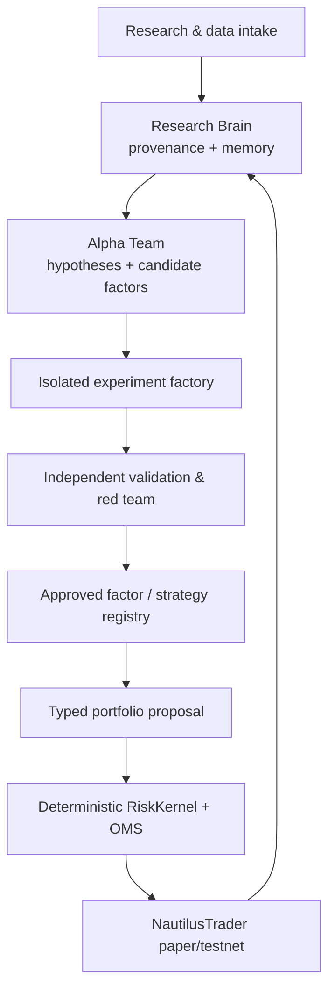
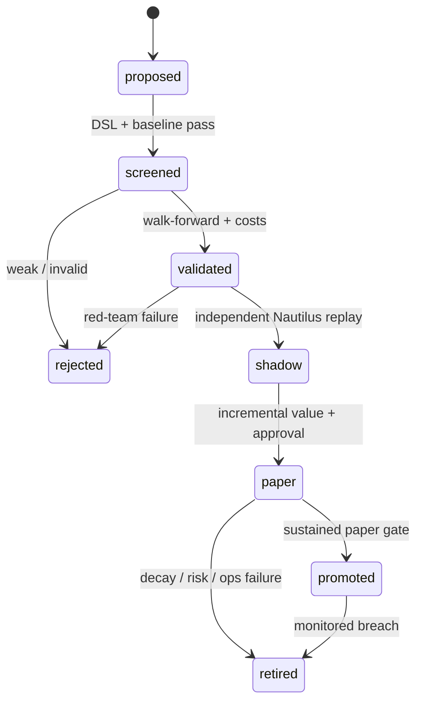

# AdvisorAI V3 — Alpha Team Extensibility Plan

**Status:** post-Core extension blueprint — paper/testnet first  
**Scope:** optional, staged extensions to the existing AdvisorAI V3 architecture: a governed Alpha Team, continuous research intake, alpha discovery, and a local research brain.  
**Does not redesign V3:** PydanticAI/Pydantic Graph remains the typed decision layer; Prefect/Hamilton remain workflow and feature owners; the deterministic Portfolio Constructor, RiskKernel, OMS ledger, and NautilusTrader remain the only trading authority.

## 1. Extension decision

The V3 base already defines the canonical data plane, Market Structure & Regime Engine, typed councils, hybrid ModelGateway, RiskKernel/OMS, NautilusTrader execution path, dashboard and Hermes Skill Foundry. **Do not replace or parallel any of them.**

Build an **Alpha Team Extension Plane** as a bounded scientific-research factory that plugs into those base services. Its job is to continually find, implement, falsify, and monitor hypotheses. Its output is evidence and versioned candidates; it cannot create an order, change a risk limit, access broker credentials, or promote itself.

The local “big brain” is **not one permanently-running giant LLM**. On the 16 GB RAM / RTX 4060 8 GB laptop, it is a durable research-memory and experiment-learning system: a local evidence store, factor registry, experiment registry, retrieval layer, and policy-controlled model gateway. API models reason over selected evidence; local models are compact and scheduled when the GPU lease is free.



The arrows to the right are one-way approval boundaries. No worker on the left can call `submit_order`, mutate a live strategy, relax a limit, or read a broker secret.

### 1.1 V3 interfaces the extension may use

| Existing V3 component | Extension may do | Extension may not do |
|---|---|---|
| Bronze/Silver/Gold data plane | request frozen, point-in-time research snapshots through a read-only `ResearchDataPort` | create an untracked data store or bypass availability/provenance checks |
| Hamilton feature graph | register a proposed feature behind a versioned `FeatureCandidatePort` | modify active features or calculate from unavailable data |
| Market Structure & Regime Engine | consume `MarketStateArtifact` and report regime-by-regime research results | replace its deterministic state calculation or declare regime from LLM prose |
| PydanticAI councils / ModelGateway | ask for typed, policy-routed research work | use an LLM as risk, promotion, or order authority |
| Prefect | schedule bounded research workflows | run unbounded 24/7 agent loops in Trade/Fast mode |
| Hermes Skill Foundry | build an isolated adapter, test, or research capability | access live credentials, alter production code, or activate itself |
| Portfolio Constructor / RiskKernel / OMS / NautilusTrader | receive a fully approved candidate for independent replay then paper routing | delegate portfolio, risk, reconciliation, or execution to an imported framework |
| Existing dashboard | add research inspection views that link to V3 decision/fill inspection | become a separate control surface for live trading |

## 2. Non-negotiable operating rules

1. **Paper/testnet only until the existing V3 paper gates pass.** No live or withdrawal-enabled credentials are present in research, agent, browser, or generated-code environments.
2. **One canonical truth per concern:** Bronze/Silver/Gold Parquet + DuckDB for data; a versioned feature/factor registry; deterministic RiskKernel/OMS for trading state; NautilusTrader for replay and venue execution.
3. **Research is not alpha.** An LLM idea, attractive chart, factor IC, in-sample Sharpe, or a library’s published result is a lead—not an approved signal.
4. **Every candidate must be reproducible.** It receives immutable code, environment, data-snapshot, feature, parameter, seed, and result hashes.
5. **No self-promotion.** The generator, evaluator, and promoter use separate processes and permissions. A candidate is promoted only by deterministic gates plus a recorded human approval during the early stages.
6. **No always-on GPU swarm.** Trade mode owns the GPU lease when needed. Mining, training, article embedding, Hermes and large backtests are queued, cancellable jobs.
7. **The Alpha Team may tighten or recommend a no-trade; it can never loosen RiskKernel limits.**

## 3. Alpha Team: roles and contracts

Run these as **elastic jobs**, not permanently chatting agents. On this laptop, start with one coordinator and at most two research workers; the coordinator serializes GPU work and caps API fan-out.

| Role | Purpose | Inputs | Permitted output | Not permitted |
|---|---|---|---|---|
| Research Scout | Collect new papers, official datasets, benchmark changes, and selected OSS releases | public APIs/RSS, allow-listed repositories | `PaperCard`, `SourceCard`, relevance score | direct web/browser tools in trade mode; unlicensed copying |
| Research Librarian | Deduplicate, extract claims/equations/assumptions, link evidence to existing work | source cards, PDFs, registry | `ClaimCard`, `MethodCard`, retrieval index | declaring a method valid |
| Quant Research Lead | Turn a defensible paper/result into a falsifiable question and acceptance plan | method cards, market-data catalogue | `HypothesisCard`, experiment design | parameters optimized from the test set |
| Factor Miner | Propose restricted-DSL features, factor transformations, or model configurations | frozen feature catalogue and hypothesis card | `CandidateFactorArtifact` | arbitrary code or direct data/broker access |
| Strategy Engineer | Implement the candidate inside a sandboxed strategy/factor template | candidate artifact, contract tests | signed `CodeCandidateArtifact` | editing production strategy code |
| Experiment Conductor | Run screened experiments with exact manifests and budget limits | frozen snapshots, code candidate | `ExperimentArtifact` | promotion or cherry-picking windows |
| Statistical Red Team | Try to falsify the result: leakage, multiple testing, costs, instability, crowding, regime fragility | all experiment evidence | `ValidationReport`, rejection reasons | generating the candidate it reviews |
| Portfolio/Risk Reviewer | Check factor exposures, capacity, overlap, volatility/liquidity stress, and portfolio incremental value | promoted-candidate candidates, MarketStateArtifact | `PromotionRecommendation` | altering hard limits or orders |
| Capability Engineer (Hermes) | Build new adapters/tools/tests inside a quarantined workspace | builder mission | `CapabilityBundle` | live-repo mutation, broker access, order tools |

Pydantic schemas define every handoff. If a schema, provenance check, or evidence threshold fails, the workflow becomes `rejected` or `needs_review`, never "best effort."

## 4. The local Research Brain

### 4.1 What it stores

Use local Parquet/DuckDB for analytical history and SQLite WAL for transactional registries. Use a local vector index only for retrieval—not as a source of truth.

| Store | Canonical objects | Reason |
|---|---|---|
| Research archive | PDF/source metadata, extraction, license, source hash, publication/version date | lets the system prove what it knew and when |
| Evidence graph | `PaperCard → ClaimCard → HypothesisCard → Candidate → Experiment → Decision` | preserves rationale and dissent |
| Feature/factor registry | DSL expression, lineage, inputs, units, lookback, universe, availability lag, exposures, decay and validity state | prevents duplicate or unexplainable factors |
| Experiment registry | manifests, window definitions, seeds, metric distributions, cost assumptions, logs and artifact hashes | makes results replayable and comparable |
| Outcome memory | shadow/paper performance, drift, calibration, slippage, regime performance, retirements | supports measured adaptation rather than narrative memory |
| Capability registry | code/skill/package hashes, tests, permissions, benchmark results and quarantine status | makes Hermes-created tools reviewable |

### 4.2 Retrieval and learning loop

1. A daily Scout job collects only allow-listed sources and records the raw document/hash.
2. The Librarian makes structured cards. Contributor models may see public text only; a private/no-training model sees minimized internal cards only when needed.
3. The Lead retrieves related failed and successful experiments before proposing new work. It must state the economic story, expected failure mode, data-availability lag, and baseline.
4. The miner searches the **registered DSL vocabulary**, not raw Python. It sees prior-trial accounting and factor redundancy so it does not repeatedly rediscover near-duplicates.
5. After paper trading, a Monitor adds observations to the outcome memory. Retraining/reweighting is an offline, versioned challenger job—not continuous unlogged online learning.

The system "learns the best approaches" by retaining evidence of what survives **out-of-sample and paper execution**, not by letting an LLM overwrite strategy logic. The default action under uncertainty is `no_trade`.

### 4.3 Data model: mandatory typed artifacts

```text
PaperCard
- source_url, source_hash, authors, publication_date, version_date, license
- domains, methods, assets, claimed result, limitations, relevance, confidence

HypothesisCard
- economic rationale, target universe, prediction horizon, decision use
- point-in-time inputs, availability lags, baseline, preregistered test plan
- expected failure modes, owner, budget, expiry

CandidateFactorArtifact
- restricted DSL AST/hash, lineage, input feature versions, lookbacks
- universe, neutralization intent, duplicate/complexity score, status

ExperimentArtifact
- candidate/code/environment/data snapshot hashes, seeds and windows
- screening/validation/holdout metrics, costs/capacity assumptions
- feature and factor exposures, regime slices, complete trial count

ValidationReport
- leakage checks, CPCV/PBO/deflated-Sharpe results, multiple-testing control
- independent replay, stability, incremental portfolio value, approve/reject reasons

PromotionDecision
- versioned policy, human approver, applicable scope, expiry, rollback condition
```

## 5. Continuous research intake

### 5.1 Start with these source families

| Family | Initial sources | Cadence | Handling rule |
|---|---|---|---|
| Quant/ML papers | arXiv `q-fin`, `stat.ML`, `cs.LG`; SSRN finance/econometrics alerts; OpenAlex/Crossref metadata | daily | preprints are leads; peer-review status and version are explicit |
| Primary market information | SEC/EDGAR, issuer IR releases, FRED/ALFRED, exchange and venue notices | event/daily | original timestamp and revision timestamps retained |
| Market-data research | existing V3 price, trades, derivatives, macro and news adapters | scheduled | Bronze → Silver → Gold point-in-time quality gates |
| OSS intelligence | GitHub releases, tags, commit/activity digest for an allow-list | weekly | source-license and supply-chain review before use |
| Benchmarks | published datasets, reproducible papers, Numerai/other research benchmarks where permitted | weekly/monthly | benchmark evidence is never direct trading data |

Do **not** indiscriminately scrape journals, paywalled portals, social networks, or arbitrary GitHub repos. Store metadata and permitted extracts; respect licenses, robots/rate limits, and terms of use. arXiv is valuable for rapid discovery but explicitly hosts preprints as well as papers, so it cannot serve as a validation stamp by itself.

### 5.2 Research triage policy

Prioritize papers/methods only when they meet at least one concrete need: new factor family, better point-in-time data method, robust validation technique, risk/execution measurement, portfolio construction, market-state modelling, or a reproducible benchmark. Score each lead on:

`relevance × evidence quality × reproducibility × data availability × compute fit × expected incremental value − licensing/security burden`.

An idea that requires proprietary data you cannot lawfully obtain, ultra-low latency, or unbounded GPU training is catalogued as `not_applicable`, not endlessly retried.

## 6. Alpha mining architecture

### 6.1 Candidate families, in the right order

Start with interpretable, low-capacity families. Add complexity only after they beat simple baselines net of costs.

1. **Market-state-conditioned technical factors:** trend, momentum, breakout, reversion, volume, realized volatility, liquidity and funding/open-interest features for BTC/ETH.
2. **Cross-sectional equity factors:** quality, value, earnings revision, profitability, investment, momentum, low-risk, liquidity and event/filing factors—only with US-equity point-in-time data and corporate actions.
3. **Relative value / statistical arbitrage:** pairs, residual momentum and cross-asset relationships only after borrow, capacity and execution assumptions are available.
4. **Probabilistic forecast features:** calibrated quantiles, tails and disagreement from the selected compact TSFM versus classical baselines.
5. **LLM-derived text features:** structured public-news/filing/event extraction validated against a non-LLM baseline. No untraceable prose sentiment becomes a production factor.

### 6.2 Restricted factor DSL

The mineable search space is a typed DSL: approved arithmetic, ranks, rolling statistics, robust transforms, lags, cross-sectional operators and domain-specific safe functions. Each operator declares input types, warm-up length, output units, look-ahead constraints and computational cost.

Disallow arbitrary `eval`, arbitrary imports, network calls, filesystem reads, future data, hidden model weights, and unconstrained generated Python. Strategy-level code generation is separately sandboxed and comes **after** DSL mining proves the economic idea.

### 6.3 Two independent engines

Use two independent implementations before promotion:

- **Fast falsification:** Polars/NumPy or VectorBT. It tests broad candidate batches cheaply.
- **Realism gate:** independent NautilusTrader replay using the canonical event/cost/latency model.

For US equities, Qlib/QuantaAlpha can be an isolated **research challenger**, but it never becomes the data source of truth, production feature owner, portfolio authority, or execution engine. Its current published configuration is centred on Qlib Chinese daily data and a Qlib Top-K/Dropout simulation, so it cannot be transferred untested to your US equities or crypto setup.

## 7. How the named repositories fit

| Project | Decision | Adopt precisely | Do not adopt |
|---|---|---|---|
| [QuantaAlpha](https://github.com/QuantaAlpha/QuantaAlpha) | **Phase 9 research challenger** | its trajectory-evolution concept, factor lineage/library UX, and hypothesis-to-factor workflow in an isolated Qlib environment | its data assumptions, Qlib backtest as truth, LLM route, or any direct path to portfolio/execution |
| [Inalpha](https://github.com/mirror29/inalpha) | **Architecture reference only initially** | factor-timing, candidate audit trail, plan/approve/execute separation, sandbox gates and factor-decay monitoring patterns | code-level integration or a production dependency; it is alpha status and AGPL-3.0, so direct reuse would carry strong copyleft obligations |
| [WorldQuant Miner](https://github.com/zhutoutoutousan/worldquant-miner) | **Reference and isolated external-platform experiment only** | restricted-expression-mining ideas, run dashboards, trial logging and rate-limit concepts | its credential file pattern, automatic submission, WorldQuant API automation, or treating platform scores as AdvisorAI validation |
| [awesome-quant](https://github.com/wilsonfreitas/awesome-quant) | **Curated discovery index** | source catalogue for a Scout allow-list, each candidate reviewed individually | mass-installing its contents or using a list entry as endorsement |
| Qlib / RD-Agent | **Post-Core equity lab** | factor/model research and benchmark replication in a sealed environment | production data, risk, backtest, OMS or execution ownership |
| Investing Algorithm Framework / VectorBT | **Research challengers** | rapid sweeps, robustness reports and experiment comparison | broker/live deployment or a second risk/OMS engine |
| TradingAgents / ai-hedge-fund | **Qualitative long-horizon shadow research** | independent bull/bear thesis and valuation research after equities expansion | mandatory live dependency, portfolio authority or order access |

No repository enters the trusted codebase merely because it has an "autonomous" label. Before any adoption: pin commit → SCA/license review → isolated install → reproducibility test on a frozen snapshot → security/tool-permission review → benchmark → CapabilityCard → quarantine/read-only activation.

### 7.1 Broader candidate landscape — capability classes, not commitments

The named projects point to a broader set of useful capability classes. Keep V3 modular by evaluating **one representative at a time** through a common adapter; do not hard-code a growing list of frameworks into the base.

| Extension capability | Good candidates to evaluate | Adapter contract into V3 | When to evaluate |
|---|---|---|---|
| Agentic factor discovery | [QuantaAlpha](https://github.com/QuantaAlpha/QuantaAlpha), [AlphaAgent](https://github.com/RndmVariableQ/AlphaAgent), [RD-Agent](https://github.com/microsoft/RD-Agent) | `CandidateFactorArtifact` only | after the internal DSL/baseline lab works |
| Classic/evolutionary symbolic search | [DEAP](https://github.com/DEAP/deap), [gplearn](https://github.com/trevorstephens/gplearn), a small native grammar search | restricted AST + all-trials manifest | before any LLM miner becomes trusted for idea volume |
| Quant research platform / benchmark replication | [Qlib](https://github.com/microsoft/qlib), original paper code, the Investing Algorithm Framework | `ExperimentArtifact` on a frozen V3 snapshot | with the US-equity research expansion |
| Factor diagnostics | [Alphalens Reloaded](https://github.com/stefan-jansen/alphalens-reloaded), native exposure/decay reports | `FactorDiagnosticArtifact` | early alpha-lab work |
| Model/parameter challenger | [Optuna](https://github.com/optuna/optuna), native grid/random baseline | registered trial budget, seed and split plan | after fixed baselines; never on a final holdout |
| Causal/economic robustness | [DoWhy](https://github.com/py-why/dowhy), econometric specification tests | `CausalReviewArtifact`, not a trade signal | only for hypotheses where a causal claim matters |
| Portfolio research challenger | [Riskfolio-Lib](https://github.com/dcajasn/Riskfolio-Lib), PyPortfolioOpt | proposed target weights plus constraint report | post-Core; RiskKernel independently recomputes all constraints |
| Time-series/statistical challenger | [sktime](https://github.com/sktime/sktime), statsmodels, arch | forecast / distribution artifact + calibration evidence | against existing classical and TSFM baselines |
| Experiment lineage and tracking | a minimal native DuckDB/SQLite registry first; evaluate MLflow only if needed | existing `ExperimentArtifact` and artifact hashes | do not add a second registry unless the native one proves insufficient |

These are **research plug-ins**, not architecture changes. For every capability class, AdvisorAI keeps the same ports: `ResearchDataPort`, `CandidatePort`, `ExperimentPort`, `ValidationPort`, `PromotionPort`, and `DashboardReadPort`. A challenger can be removed without changing the base data, market-state, portfolio, risk, OMS, or execution components.

## 8. Scientific promotion pipeline



Every transition is fully recorded. A candidate must pass all of the following:

1. **Point-in-time truth:** `event_ts` and `available_ts`; corporate actions and revisions; no feature is usable before it existed.
2. **Preregistered baselines:** buy-and-hold, simple trend/reversion, naive/seasonal forecasts, and a correctly specified low-complexity model.
3. **Temporal validation:** purged and embargoed walk-forward or combinatorial purged CV where appropriate; untouched final holdout; no test-set parameter selection.
4. **Multiple-testing accounting:** every attempted candidate is counted. Use deflated/probabilistic Sharpe and PBO/CPCV or equivalent robust diagnostics; report distributions, not only the winner.
5. **Realism:** fees, spreads, slippage, impact/capacity, delay, order constraints, borrow/funding, incomplete fills, turnover and data outages.
6. **Robustness:** sensible parameter neighbourhoods, data perturbations, subperiods, asset/universe slices, regime/stress slices, and factor overlap/correlation.
7. **Independence:** a different implementation replays finalists in NautilusTrader; a separate Red Team tests leakage and survivorship bias.
8. **Portfolio incrementality:** the candidate must improve the current portfolio after correlation, factor exposures, risk budget, concentration and costs—not merely have an attractive standalone statistic.
9. **Paper evidence:** shadow signal then paper/testnet behavior agrees with simulated assumptions over a preregistered number of decisions and market states.

Initial promotion should require your explicit approval. Only after a long stable paper record should promotion become policy-automated—and even then it means “eligible for a bounded paper strategy,” never an automatic live-capital increase.

## 9. Model and agent policy

| Tier | Approved work | Data class | Authority |
|---|---|---|---|
| Contributor/low-cost API model | public paper summaries, citation extraction, entity tagging, generic DSL sketches, generic test drafts | `PUBLIC` only | typed, non-authoritative outputs |
| Private/no-training or ZDR API model | confidential research synthesis, disagreement review, sanitized experiment interpretation | `CONFIDENTIAL` minimized cards | proposes only |
| Local compact model | offline public retrieval/classification or small code assist while idle | local approved corpus | proposes only |
| Deterministic software | factors, metrics, validation, portfolio, risk, OMS, reconciliation | authoritative internal state | only system that may approve/reject/send trade intents |

The ModelGateway must classify, redact, enforce schemas, attach provider/model/route/retention metadata, and store prompt/evidence hashes. Contributor routes get no tools, no raw internal data, no research code, no portfolio information, and no credentials. Private models get read-only, scoped evidence cards and still receive no broker/order tool.

Hermes is used only in **Deep**, **Builder**, or **Recovery** jobs. It runs in an isolated task directory/container with no broker credentials, no production repository write access, no shell access outside its workspace, and no live order tool. Its skills export through CapabilityCards and must earn admission through the same validation route.

## 10. Operations, dashboard and observability

Extend the local AdvisorAI dashboard with an Alpha Team section. The main drill-down must be:

`paper alert → candidate/strategy version → paper outcome → frozen decision snapshot → MarketStateArtifact → factor/forecast evidence → RiskKernel result → order/fill → TCA and attribution`.

Required screens:

- **Research inbox:** new papers/repos, licensing, relevance score and paper-to-hypothesis conversion.
- **Hypothesis & factor registry:** lineages, duplicates, registered inputs, expiry/decay, current status and prior failures.
- **Experiment inspector:** full trial count, preregistration, windows, metrics, costs, statistical diagnostics, regime slices and red-team verdict.
- **Promotion board:** candidate state, approval history, rollback reason and paper gate progress.
- **Market-state and portfolio overlay:** strategy eligibility, correlation/covariance stress, liquidity warning, exposures and risk-budget effect.
- **Operations:** scheduler queue, API token/cost budget, GPU/RAM lease, data freshness, failed tasks and security denials.

For this one-node deployment, use the existing `advisor-api` plus lightweight server-rendered/HTMX pages or Streamlit for research views. Persist traces in SQLite/Parquet. Do not add a permanently running Grafana/Prometheus stack unless the simple dashboard is demonstrably insufficient.

## 11. Extension sequence and admission gates

This is deliberately **not a second V3 roadmap**. The following optional extension tracks begin only at their named V3 integration point; all existing V3 phase ownership and gates stay unchanged.

| Stage | Deliverable | Gate to proceed |
|---|---|---|
| **E0 — V3-Core prerequisite** | no new component: confirm existing V3 Phase 0–7 paper/recovery/data/risk gates | all safety, reconciliation, resource and recovery gates pass with all AI services stopped |
| **E1 — Research Brain add-on** *(after existing Phase 7)* | schemas, DuckDB/SQLite extension registries, evidence graph, source policy, paper/repo Scout, provenance and license checks | one paper and one failed strategy can be traced end-to-end and replayed |
| **E2 — Controlled Alpha Lab** *(inside existing Phase 8/9 research scope)* | DSL, feature catalog, baseline suite, fast screen, full manifest, validation/red-team service and research dashboard views | intentionally leaky/overfit candidates are rejected; a known baseline reproduces |
| **E3 — First V3 strategy challenger** | a small BTC/ETH research-only candidate set using existing MarketStateArtifact and independent Nautilus replay | incremental net value versus the existing V3 baseline across preregistered regimes; eligible for a paper shadow only |
| **E4 — Optional capability adapters** | one isolated Hermes/QuantaAlpha/AlphaAgent/Qlib/DEAP/Optuna adapter at a time, with CapabilityCards and code-sandbox checks | adapter is removable, cannot escape sandbox, and produces a valid replayable artifact |
| **E5 — Equity and long-horizon research extension** | SEC/IR/corporate-action snapshots, equity factor families, valuation/event research cards, paper ledger | clean point-in-time history and corporate-action correctness; no crypto assumption is reused blindly |
| **E6 — Controlled candidate expansion** | limited approved-paper candidates, factor decay monitor and capital-allocation research | 60+ days of healthy unattended paper behavior per scope; no unresolved reconciliation or data-quality incident |
| **E7 — Optional bounded-live scope** | no architecture change: use existing V3 live-capital gate, credential enclave, caps and emergency controls | explicit separate go-live review; paper results and operations demonstrate parity; immediate paper rollback is tested |

Do not set calendar dates for promotion. Progress depends on evidence and gates, not agent activity volume.

## 12. Resource plan for the laptop

- **Trade/Fast mode:** only collectors, cached/CPU calculations, Market Structure engine, RiskKernel/OMS and Nautilus adapters. No browser, Hermes, mining, Qlib, training, or paper ingestion jobs in the hot path.
- **Research mode:** one medium experiment at a time. CPU first. Use Polars/DuckDB data scans; cap parallel backtests; persist/checkpoint every job.
- **GPU lease:** one of compact forecast/model inference, local embedding/index refresh, model training, or isolated local LLM—never all together. Training and mining automatically yield to trading health.
- **Budgets:** per-hypothesis maximum tokens, wall time, CPU/RAM/GPU, candidate count, and API spend. A job that exceeds budget returns a partial `ExperimentArtifact` and requires a new approved mission.
- **Backups:** immutable experiment artifacts and registry snapshots; no model weight downloads or raw secrets in Git.

## 13. Initial success metrics

Measure the Alpha Team as a scientific system before judging it by P&L:

| Dimension | Initial measure |
|---|---|
| Reproducibility | 100% of reviewed candidates replay from manifest; failed replays block promotion |
| Research quality | rejection rate, duplicate rate, leakage catches, and time-to-falsification are reported—not hidden |
| Validation integrity | all trials counted; holdout untouched; independent replay agreement |
| Data integrity | freshness, availability-time coverage, revisions, corporate-action checks and source lineage |
| Alpha quality | net-of-cost incremental return/risk, calibration, turnover, capacity, regime stability and paper-simulation agreement |
| Safety | zero research/LLM/Hermes order calls; zero policy bypasses; reconciliation complete before strategy reactivation |
| Resource discipline | GPU/RAM/API budget compliance and no trade-mode missed safety deadline due to research load |

## 14. What not to build

- A single all-powerful “autonomous trader” agent.
- A 24/7 self-modifying LLM that edits production strategy code or retrains itself from recent P&L.
- Automatic WorldQuant submission, or a WorldQuant score treated as deployable alpha.
- Qlib, Inalpha, Freqtrade, IAF, or a third-party project as a second production OMS/risk/execution engine.
- A vector database treated as memory truth, opaque agent consensus treated as independent evidence, or 3-D/“quantum” surfaces treated as predictive proof.
- HFT/market-making claims on free data and a non-colocated laptop.

## 15. First concrete sprint after V3-Core

1. Add the six typed artifacts in §4.3 and the SQLite/DuckDB registries.
2. Implement an allow-listed arXiv/OpenAlex/GitHub Scout that produces `PaperCard`s and provenance records.
3. Define the safe factor DSL and feature availability contract; register ten simple BTC/ETH factors with unit tests.
4. Build the baseline suite plus a deliberately leaky factor to prove the Red Team rejects it.
5. Export a single `ExperimentArtifact` from a Polars/VectorBT screen, then reproduce it through NautilusTrader replay.
6. Add the Research Inbox, Factor Registry and Experiment Inspector dashboard views.
7. Only then run the first bounded factor-mining mission: 50 candidates maximum, fixed universe/windows/budget, all trial accounting enabled.

## Sources reviewed

- [QuantaAlpha repository](https://github.com/QuantaAlpha/QuantaAlpha) and its [backtest configuration](https://github.com/QuantaAlpha/QuantaAlpha/blob/main/configs/backtest.yaml): useful evolutionary factor-mining patterns, but its supplied configuration is a Qlib China daily-data research setup.
- [Inalpha repository](https://github.com/mirror29/inalpha): useful audited-agent and factor-timing design patterns; it is explicitly alpha status and AGPL-3.0.
- [WorldQuant Miner repository](https://github.com/zhutoutoutousan/worldquant-miner): a reference for expression-mining workflows, but it includes external-platform credentials and automatic submission concepts that are excluded here.
- [awesome-quant](https://github.com/wilsonfreitas/awesome-quant): a discovery catalogue, not an approved dependency list.
- [arXiv](https://info.arxiv.org/about/index.html): open research discovery; sources must retain peer-review/version status rather than being accepted on discovery alone.
