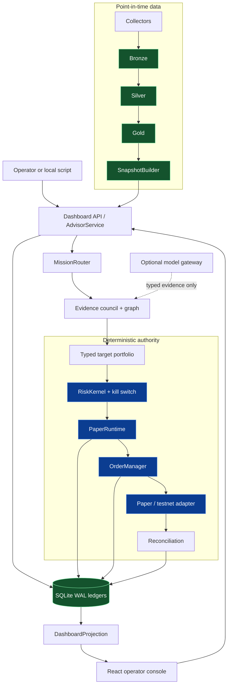

# Architecture

This page describes the current implementation. The repository also contains a staged architecture and phase plans; those documents define target design and admission policy, not proof that every proposed process is deployed. Current product planning targets an owner-operated, session-oriented workstation with optional always-on deployment. See [Project status](status.md), the [phase plan index](../plans/README.md), and the [session lifecycle plan](../plans/session-oriented-runtime.md) for that distinction.

## Design goals

AdvisorAI V3 is organized around a small set of boundaries:

- time-aware evidence must be available at the snapshot cutoff;
- probabilistic agents and model adapters produce typed proposals or evidence, not orders;
- deterministic risk and execution services own approval, routing, reconciliation, and halt behavior;
- immutable Parquet artifacts preserve source and parser provenance;
- SQLite WAL ledgers preserve idempotent operational events;
- optional providers and runtimes are explicit, policy-checked, and phase-gated.

## Current implementation at a glance


```mermaid
flowchart TD
    OP[Operator or local script] --> API[Dashboard API / AdvisorService]

    subgraph DATA["Point-in-time data"]
        SOURCES[Collectors] --> BRONZE[Bronze]
        BRONZE --> SILVER[Silver]
        SILVER --> GOLD[Gold]
        GOLD --> PIT[SnapshotBuilder]
    end

    PIT --> API
    API --> ROUTE[MissionRouter]
    ROUTE --> EVID[Evidence council + graph]
    EVID --> TARGET[Typed target portfolio]
    MODEL[Optional model gateway] -. typed evidence only .-> EVID

    subgraph AUTH["Deterministic authority"]
        TARGET --> RISK[RiskKernel + kill switch]
        RISK --> RUNTIME[PaperRuntime]
        RUNTIME --> OMS[OrderManager]
        OMS --> VENUE[Paper / testnet adapter]
        VENUE --> RECON[Reconciliation]
    end

    LEDGER[(SQLite WAL ledgers)]
    API --> LEDGER
    RUNTIME --> LEDGER
    OMS --> LEDGER
    RECON --> LEDGER
    DASH[React operator console] --> API
    PROJ[DashboardProjection] --> DASH
    LEDGER --> PROJ

    classDef authority fill:#0b3d91,color:#fff,stroke:#8bb8ff
    classDef durable fill:#14532d,color:#fff,stroke:#86efac
    class RISK,RUNTIME,OMS,VENUE authority
    class BRONZE,SILVER,GOLD,PIT,LEDGER durable
```

The diagram shows the currently implemented authority path, not a promise of a permanently running distributed deployment. The local launcher starts the dashboard API and Vite UI only. `ServiceRegistry` describes ownership and dependency order for the broader topology; it is not a process supervisor. The future Decision Model layer described below is a planning target and is not represented as implemented in this current-state diagram.

## Runtime boundaries

| Boundary | Responsibility | Explicitly not responsible for | Main implementation |
| --- | --- | --- | --- |
| Collectors | Acquire source payloads, identify origins, record retrieval and health metadata | Approving a trade or mutating the risk ledger | [`collectors/`](../../src/advisorai/collectors/) |
| Data lake | Materialize immutable Bronze/Silver/Gold Parquet artifacts and manifests | Serving as the account or order authority | [`lake/storage.py`](../../src/advisorai/lake/storage.py) |
| Point-in-time layer | Reject observations or artifacts unavailable at a cutoff and build snapshots | Repairing a source or deciding whether a target is attractive | [`lake/point_in_time.py`](../../src/advisorai/lake/point_in_time.py) |
| Mission service | Route a mission, run evidence roles, apply evidence-family thresholds, and build a target portfolio | Creating or routing orders | [`api/service.py`](../../src/advisorai/api/service.py) |
| Evidence council | Run typed role callables and collect evidence, dissent, and agent-run records | Risk approval, venue access, or direct side effects | [`agents/council.py`](../../src/advisorai/agents/council.py) |
| Evidence graph | Check timing, source/factor diversity, ancestry, support, and deterministic gate rules | Replacing the risk kernel | [`agents/fusion.py`](../../src/advisorai/agents/fusion.py) |
| Risk kernel | Apply policy, account, market, freshness, kill-switch, drift, and hard-limit checks; approve, reduce, or reject | Loosening limits because an agent requested it | [`execution/risk.py`](../../src/advisorai/execution/risk.py) |
| Runtime | Enforce cadence and closed cutoffs, invoke the decision path, re-check each order, and handle reconciliation | Operating a live endpoint or bypassing risk | [`runtime/paper.py`](../../src/advisorai/runtime/paper.py) |
| OMS and adapters | Maintain order state, idempotency, venue acknowledgement, and reconciliation behavior | Choosing a target or overriding risk | [`execution/oms.py`](../../src/advisorai/execution/oms.py), [`execution/native.py`](../../src/advisorai/execution/native.py) |
| Ledgers | Append namespaced, idempotent account/order/mission/model/capability/incident events | Reconstructing arbitrary external history without an adapter snapshot | [`ledger/sqlite.py`](../../src/advisorai/ledger/sqlite.py) |
| Dashboard API | Expose health, projections, auth, audit, paper cycles, source health, and guarded control commands | Becoming a live order API | [`api/dashboard.py`](../../src/advisorai/api/dashboard.py) |

## Data ownership

The repository keeps durable concerns separate even when a local deployment stores them under one state root:

- **Parquet and manifests** own immutable source and normalized observations.
- **Snapshots** own a point-in-time view used by a mission.
- **SQLite WAL namespaces** own append-only operational events. The namespaces are `account`, `order`, `mission`, `model`, `capability`, and `incident`.
- **The risk kernel** owns the decision to approve, reduce, or reject a target/order under the supplied policy and current state.
- **The dashboard projection** owns a read model for the operator surface. It can be ledger-backed when configured or explicitly synthetic for local UI development.

`LakeQuery` is deliberately read-only and restricts file access to the configured local lake root. It does not write the lake or ledger.

## Optional providers and runtimes

Provider-shaped seams exist for model gateways, HTTP transports, archives, event buses, market collectors, and venue adapters. Their presence in the source tree or installation extras means that a seam or adapter exists; it does not mean the provider is configured, reachable, or admitted for an operating mode. Runtime admission is checked through the phase gate and capability policies.

The optional runtime wrappers include PydanticAI/Graph, Prefect, Hamilton, LiteLLM, and NautilusTrader integrations. The base repository remains usable without installing those extras. Read [Model gateway policy](../runbooks/model-gateway-policy.md), [runtime qualification](../runbooks/model-runtime-qualification.md), and [Project status](status.md) before treating an optional adapter as authoritative.

## Target process boundaries

`src/advisorai/services/boundaries.py` defines an ownership manifest with core descriptors such as `advisor-api`, `market-node`, `collector-node`, `data-writer`, `account-ledger`, and `resource-governor`, plus on-demand workers such as `agent-fabric`, `model-gateway`, `quant-worker`, and `risk-worker`. “Core/always-on” in that manifest means core to an active deployment profile; it does not require processes to remain resident between owner sessions. The manifest validates dependency order and ownership collisions. It does not create these processes, monitor them, or make the repository a distributed service deployment.

## Target session and Decision Model layers

The target normal workflow is: start the application; verify identities and
ledgers; recover authoritative state; reconcile paper/testnet account, order,
and position state; detect and backfill permitted data gaps; rebuild the
current PIT snapshot; start only required workers; operate for the session;
then stop, reconcile, persist checkpoints/watermarks, release model/runtime
leases, and write an immutable session-end record. Crash recovery enters
recovery mode and reconciles before new actions. See the full typed flow in
[session-oriented runtime](../plans/session-oriented-runtime.md). These
lifecycle steps are planned work, not a claim about the local launcher.

The target analysis path adds this typed boundary:

```text
validated PIT snapshot
  -> forecast / tabular / financial NLP / deterministic evidence
  -> EvidenceGraph and calibrated evidence bundle
  -> DecisionModelPort -> typed DecisionProposal
  -> deterministic Portfolio Constructor
  -> RiskKernel -> OMS -> NautilusTrader
  -> reconciliation -> TCA/attribution -> outcome memory
```

`DecisionModelPort` is planned. It may return stance/probabilities,
confidence, horizon, uncertainty, evidence references, missing-evidence and
disagreement flags, and expiry. It is not risk or execution authority and may
not override EvidenceGraph failure, missing/stale data, portfolio constraints,
or RiskKernel. The model roster and adapter admission levels are in the
[authoritative architecture](../../advisorai-federated-multi-agent-quant-architecture-v3.md)
and [ADR 0009](../decisions/0009-typed-decision-model-boundary.md).

Implementation readiness is separate from operational admission: quarantined
later-phase software may be built before a model/source/capability gate passes,
but promotion and authority remain gated. Historical timed evidence is
preserved; session recovery is the primary future workstation validation
focus.

## Further reading

- [Data flow](data-flow.md)
- [Execution model](execution-model.md)
- [Components reference](../reference/components.md)
- [Canonical trading authority decision](../decisions/0001-canonical-trading-authority.md)
- [Runtime dependency boundary decision](../decisions/0006-runtime-dependency-boundary.md)
- [Session-oriented operating model decision](../decisions/0007-session-oriented-operating-model.md)
- [Reference model fabric decision](../decisions/0008-reference-model-fabric-and-deferred-bakeoffs.md)
- [Typed Decision Model decision](../decisions/0009-typed-decision-model-boundary.md)
- [Architecture dossier](../../advisorai-federated-multi-agent-quant-architecture-v3.md)
