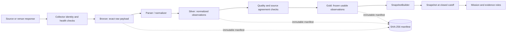
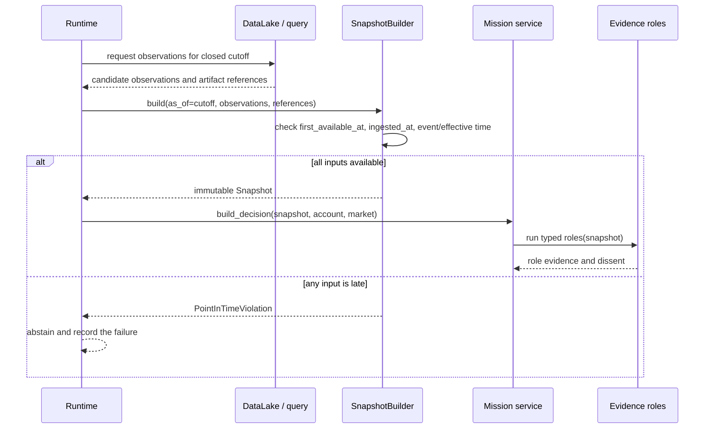

# Data flow and point-in-time control

AdvisorAI treats data availability as part of the data model. A record's event time is not enough: `first_available_at` and `ingested_at` are checked against the snapshot cutoff before the record can support a decision.

## Acquisition to snapshot

`DataLake.write_bronze` stores the raw payload with source family, origin, availability, ingestion, and parser metadata. `write_observations` stores normalized observations in Silver or Gold. Artifacts are content-addressed and existing files are verified rather than overwritten.

## Snapshot admission

The paper runtime also rejects a provider-supplied snapshot whose `as_of` is later than the requested cutoff and rejects snapshots whose data quality state is not `validated` or `gold`.

## Source diversity and quality

The evidence gate requires at least two source families and three factor families in the `AdvisorService` path. The exact source registry and grades are configured in [`configs/sources/v3_core.yaml`](../../configs/sources/v3_core.yaml). Collectors and quality modules provide the building blocks for freshness, source health, disagreement, failover, and official/vintaged data checks.

Source diversity is not a guarantee of independence. `EvidenceGraph` discounts or rejects correlated evidence using source and model ancestry metadata. A source can be available and still be unusable for a decision if it is stale, expired, disagreed, unsupported, or outside the cutoff.

## Failure behavior

| Condition | Data-path response | Decision/execution consequence |
| --- | --- | --- |
| Source payload cannot be verified | Collector records an error or refuses the payload | The affected evidence is unavailable |
| Observation becomes available after cutoff | `SnapshotBuilder` raises `PointInTimeViolation` | The runtime abstains |
| Snapshot is after the requested cutoff | Runtime records `snapshot_after_cutoff` | The runtime abstains |
| Snapshot quality is not validated/Gold | Runtime records a data-quality reason | The runtime abstains |
| Sources disagree or evidence expires | Quality/evidence gate carries the finding | Mission can abstain; it cannot silently proceed |
| Lake artifact or manifest hash changes | Data lake verification raises | The artifact is not admitted to a read |
| Read query requests mutation, remote URL, or outside path | `LakeQuery` rejects the query | No lake mutation or remote read occurs |

## Ownership and storage

The local lake root is supplied to `DataLake`/`LakeQuery`; operational state is supplied separately to `SqliteLedgers`. The dashboard may project from a configured ledger path, but its synthetic fixture is intentionally labelled and is not a market-data feed.

See [Configuration](../getting-started/configuration.md) for the repository roots and [Architecture](architecture.md) for the boundary map.
