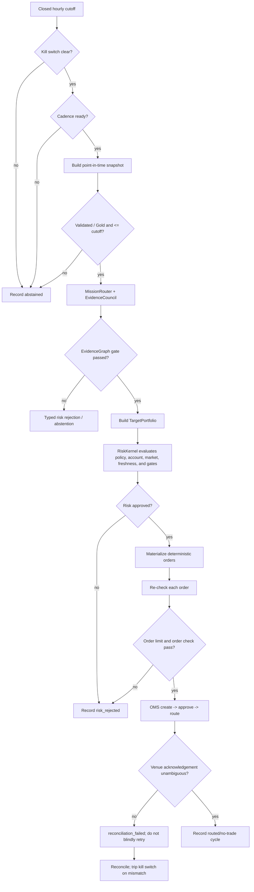
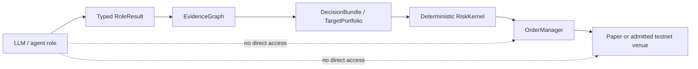
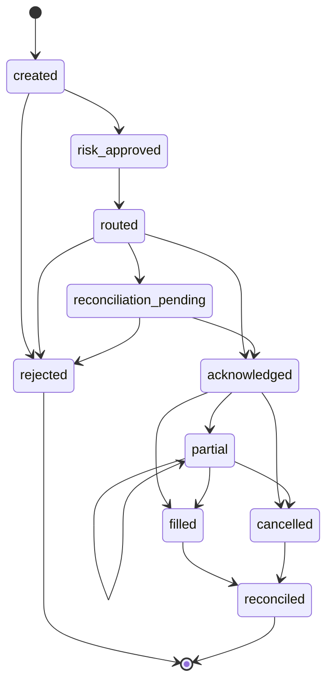

# Execution model

The implemented execution path is a deterministic paper/testnet transition loop. It accepts evidence and target proposals from the mission layer, but order authority remains below the agent boundary.

## One paper cycle

`PaperRuntimeConfig` restricts the transition runtime to `paper`, `testnet`, or `paper_testnet` and to the V3-Core `BTC`/`ETH` instruments. The default observation interval is 300 seconds and the default decision interval is 3600 seconds. These defaults are implementation details, not performance claims.

## Agent authority boundary

Evidence roles receive a snapshot and return typed results. `AdvisorService` converts a passing evidence gate into a target portfolio; it does not create an order. The runtime and OMS own order materialization, idempotency, routing, acknowledgement, and reconciliation.

## Risk authority

The risk kernel can approve, reduce, or reject. AI-originated suggestions cannot loosen the loaded policy. Checks include the policy version/effective time, independent kill switch, stale or disagreed data, model drift or unsupported state, expired decisions, reconciliation state, market marks, and configured hard limits. The configured V3-Core policy includes gross/net exposure, order, position, leverage, turnover, margin, and price-collar limits; see the [risk configuration reference](../reference/configuration.md).

## Order lifecycle

An ambiguous acknowledgement is not treated as a clean rejection. The OMS holds the order for reconciliation, and the runtime records `reconciliation_failed`. A reconciliation mismatch trips the independent kill switch.

## Paper, testnet, and live state

The ordinary runtime path is paper/testnet only. A separate `LiveControlPlane` models `paper`, `ready`, `active`, and `rolled_back`, but activation requires explicit human authorization, a passed readiness evaluation, a valid Phase 10 gate when phase gates are attached, and a valid authorization at the evaluation time. The dashboard command surface does not expose live activation or arbitrary live order submission.

This distinction matters:

| State | Meaning in the code | Current repository posture |
| --- | --- | --- |
| Paper/testnet runtime | Transition runtime can evaluate and route through its configured paper/testnet adapter | Implemented and exercised locally |
| Live control model | Guarded state machine and readiness checks exist | Implemented as a gate-controlled seam |
| Live operation | External timed evidence, authorization, deployment controls, and venue readiness are all required | Not enabled by the local quickstart |

## Learning and audit

When configured, the paper runtime records paper decision records for later replay/learning. Mission, order, model, capability, and incident events are written through idempotent ledger events. A recorded event is evidence of what the local code observed and decided; it is not a claim that a live venue filled an order.
