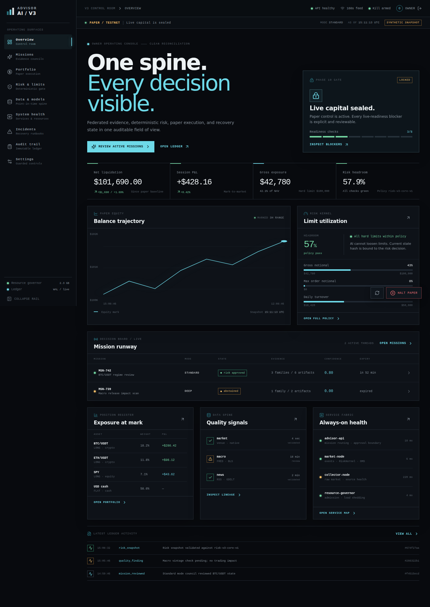

# Quickstart

This path takes a new checkout from installation to a verified local dashboard. It uses no credentials and no network-dependent provider workflow.

## 1. Install and validate the base project

```bash
uv sync --group dev
PYTEST_DISABLE_PLUGIN_AUTOLOAD=1 uv run pytest -q
uv run ruff check .
```

The full test command exercises the current contract, data, execution, API, capability, recovery, and gate coverage. The exact test taxonomy is documented in [Testing](../development/testing.md).

## 2. Validate the reviewed V3-Core configuration

```bash
uv run python -c "from pathlib import Path; from advisorai.config import load_v3_core_config, load_risk_config, load_agent_config, load_model_config, load_execution_config, load_source_registry_config, load_resource_config; root=Path('.'); values=(load_v3_core_config(root/'configs/v3_core.yaml'), load_risk_config(root/'configs/risk/v3_core.yaml'), load_agent_config(root/'configs/agents/v3_core.yaml'), load_model_config(root/'configs/models/v3_core.yaml'), load_execution_config(root/'configs/execution/v3_core.yaml'), load_source_registry_config(root/'configs/sources/v3_core.yaml'), load_resource_config(root/'configs/resources/v3_core.yaml')); print('validated', len(values), values[0].universe, values[0].execution)"
```

Expected output:

```text
validated 7 ('BTC', 'ETH') paper_testnet_only
```

The YAML is validated into immutable configuration objects; it is not a replacement for a phase gate or an operator approval record.

## 3. Launch the operator console

```bash
./scripts/launch_dashboard.sh
```

Open <http://localhost:5173>. The launcher starts:

| Process | Address | Role |
| --- | --- | --- |
| Dashboard API | `http://127.0.0.1:8787` | Optional typed FastAPI projection and guarded command boundary |
| Vite console | `http://127.0.0.1:5173` | React operator surface; proxies `/api` to the API |

Confirm the API independently:

```bash
curl http://127.0.0.1:8787/api/v1/health
```

```json
{"status":"ok","environment":"paper_testnet"}
```

The UI falls back to `build_demo_overview()` when the API is unavailable and marks that state as synthetic. In the normal launcher path, the API is available and the same explicit synthetic fixture is used until a ledger path is configured.



## 4. Inspect the important surfaces

- [Missions](../assets/screenshots/dashboard-missions-synthetic.png) shows evidence families, dissent, expiry, and abstention.
- [Risk & limits](../assets/screenshots/dashboard-risk-synthetic.png) shows the deterministic veto boundary and policy utilization.
- [Operator console guide](../guides/operator-console.md) explains protected mode, ledger-backed projections, and guarded commands.

## 5. Run the phase-isolated acceptance runner

For local executable evidence, run the phases in their intended order:

```bash
PYTEST_DISABLE_PLUGIN_AUTOLOAD=1 uv run python scripts/verify_acceptance.py
```

To debug one suite without claiming later phases:

```bash
PYTEST_DISABLE_PLUGIN_AUTOLOAD=1 uv run python scripts/verify_acceptance.py --phase 2
```

The runner stops at the first failed phase. Timed Phase 0/7 evidence and explicit Phase 10 human approval are separate artifacts; a green local suite does not create them.

## What this quickstart does not do

- It does not contact an LLM, market-data source, archive remote, or venue.
- It does not create live credentials or submit live orders.
- It does not start the target multi-process service topology.
- It does not promote a model, connector, or capability.

For opt-in connector work, start with [Configuration](configuration.md), [Credential scopes](../runbooks/credential-scopes.md), and the relevant [transition runbooks](../plans/real-api-paper-transition.md).
