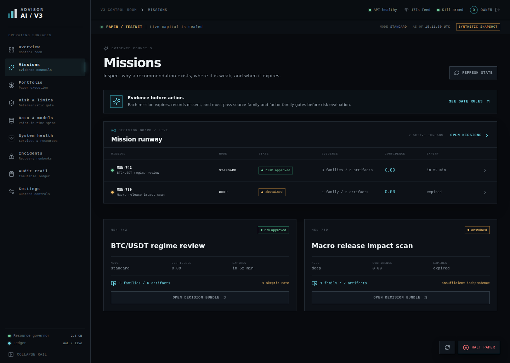
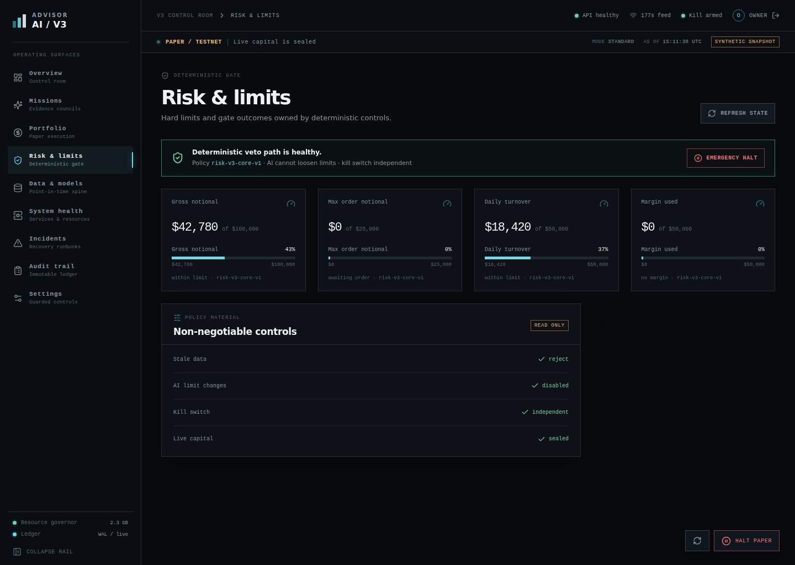

# Operator console

The optional React/FastAPI console is a local operator surface for inspecting paper state, evidence, risk, data health, service ownership, incidents, audit events, and guarded controls. It is not a live trading terminal.

## Start it

For local UI development, use the launcher from the repository root:

```bash
./scripts/launch_dashboard.sh
```

This starts the API at `http://127.0.0.1:8787`, waits for `/api/v1/health`, and starts the Vite console at `http://127.0.0.1:5173`. The default launcher path sets `ADVISORAI_DASHBOARD_DEV_MODE=1`; the UI labels its data as a synthetic snapshot. See [Quickstart](../getting-started/quickstart.md) for a verified walkthrough.

To exercise the protected path, generate authentication material without writing it to the repository:

```bash
uv run --extra dashboard python scripts/bootstrap_dashboard_auth.py
./scripts/launch_dashboard.sh --protected
```

The bootstrap script prints an Argon2id password hash and a TOTP secret. Put them into a protected environment or service manager. Do not paste them into a shell transcript, issue, screenshot, or tracked file. Protected deployments also need TLS and a deliberate `ADVISORAI_DASHBOARD_ALLOWED_ORIGINS` value; the repository does not provide a certificate manager or deployment supervisor.

## What each surface shows

| Surface | Current purpose |
| --- | --- |
| Overview | Paper/testnet state, synthetic/live-projection label, metrics, risk summary, mission summary, data quality, service health, audit preview, and Phase 10 sealed status |
| Missions | Evidence-council results, source/factor gate context, confidence, expiry, dissent, and links to the audit view |
| Portfolio | Position register at the authoritative mark and the explicit target-to-order RiskKernel boundary |
| Risk & limits | Deterministic hard-limit utilization, stale-data behavior, independent kill switch, and an emergency paper halt action |
| Data & models | Point-in-time data spine, source health, freshness, observations, source families, and model/evidence lanes |
| System health | Service registry projection, resource headroom, ledger state, and load-shedding order |
| Incidents | Incident ledger projection and containment/reconciliation/correction status; the current runbook button is informational |
| Audit trail | Append-only event projection with actor, timestamp, event type, summary, and hash fragment |
| Settings | Operating-mode proposals, security posture, guarded configuration proposal, and explicit live blockers |

The navigation labels and these boundaries come from [`dashboard/src/App.tsx`](../../dashboard/src/App.tsx). The API projection can be built from an SQLite ledger path or from `build_demo_overview()` when no authoritative projection is configured. Synthetic values are intentionally not evidence of performance or venue state.

## Screenshots

These repository-owned screenshots were captured from the current local dashboard in development mode. They are useful for orientation only; the values are synthetic fixtures.

| View | Preview |
| --- | --- |
| Overview |  |
| Missions |  |
| Risk & limits |  |

## Guarded commands

The current command contract accepts:

- `halt_paper`
- `resume_paper`
- `set_mode`
- `propose_config`
- `rollback_config`
- `refresh_data`

Commands require a reason, explicit confirmation, and an idempotency key. In protected mode, state-changing requests use the session's CSRF token. Halt, resume, mode, proposal, and rollback commands also require a fresh step-up authentication token. Receipts are persisted to the incident ledger when a reviewed ledger path is configured.

The controls are bounded by the owning services. For example, `set_mode` changes mode admission; it does not change hard risk limits. `propose_config` stages a reviewable proposal; it does not let the browser mutate policy directly. There is no dashboard command for live activation or arbitrary live order submission.

## Read path and fallback behavior

The UI asks the API for auth status and overview data. If the API is unavailable, the React app can render its bundled synthetic fixture and marks the source as synthetic. This makes UI development possible without credentials, but it also means a visible screen is not proof that the API, ledger, source workers, or venue are healthy.

The API exposes sanitized projections. It does not expose raw credentials, arbitrary local file reads, or an OpenAPI documentation route (`docs_url=None` in the application factory).

## Operational cautions

- Use the default launcher only on a trusted local development machine.
- Use `--protected` with configured password/TOTP material before exposing the API beyond localhost.
- Keep `ADVISORAI_DASHBOARD_COOKIE_SECURE=1` when using TLS.
- Treat `ADVISORAI_DASHBOARD_LEDGER_PATH` and `ADVISORAI_CONFIG_BUNDLE_PATH` as reviewed state locations; do not point them at shared or untrusted paths.
- A green dashboard card is a projection, not a replacement for phase-gate evidence, reconciliation, or the underlying ledger.

For the HTTP contract, see [Dashboard API reference](../reference/api.md). For credential scoping, see [Credential scopes](../runbooks/credential-scopes.md).
