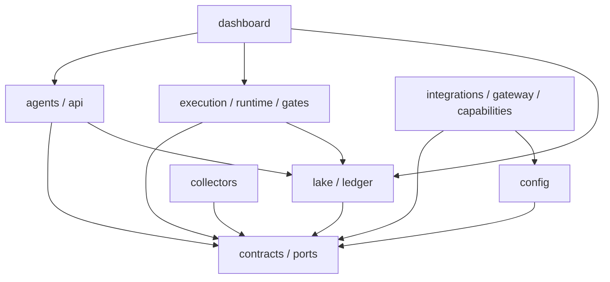

# Components reference

The source tree is organized by contracts and ownership boundaries rather than by a single framework. The following map names the important packages a contributor is likely to touch.

## Package map

| Package | Responsibility |
| --- | --- |
| `contracts` | Pydantic domain artifacts: snapshots, observations, decisions, targets, orders, risk decisions, gates, and identity records |
| `ports` | Protocols and typed request/response contracts for gateways, archives, event buses, transports, and other replaceable seams |
| `config` | Typed YAML loaders, safe environment parsing, credential scopes, content-addressed config bundles, and transition validation |
| `lake` | Immutable Parquet storage/manifests, read-only DuckDB/Polars queries, and point-in-time snapshot admission |
| `ledger` | SQLite WAL event namespaces, idempotent append semantics, and event outbox/replay primitives |
| `collectors` | Market, RSS, official/vintaged, quality, failover, disagreement, and source-health acquisition logic |
| `agents` | Mission routing, evidence roles, council waves, evidence graph, dissent, and target-decision assembly |
| `api` | Mission service plus optional dashboard projection and FastAPI authentication/control boundary |
| `execution` | Risk kernel, kill switch, order manager, execution policies, venue adapters, reconciliation, and market-event processing |
| `runtime` | Paper runtime, cadence, and the single-owner transition loop |
| `gates` / `live` | Phase-gate records and guarded paper/ready/live/rollback control model |
| `gateway` / `integrations` | Governed model gateway, HTTP/LLM adapters, native venue and websocket integrations |
| `models` / `learning` | Model authority, forecasting candidates, paper utility/replay, and learning records |
| `capabilities` | Capability cards, broker permissions, Hermes isolation, and lifecycle evidence |
| `services` | Immutable service ownership/dependency manifest and mode admission |
| `recovery` / `resources` / `observability` | Restart/rollback evidence, resource governor, health, and operational records |

## Dependency direction

The important rule is that higher-level proposal producers depend on typed contracts and storage interfaces, while order authority remains in `execution`/`runtime`. Provider adapters are injected behind ports and do not become authorities merely by being importable.

## Service ownership manifest

`ServiceRegistry` currently declares these always-on ownership boundaries:

| Service | Owns |
| --- | --- |
| `advisor-api` | Mission routing, typed API, approval boundary |
| `market-node` | Market events, `RiskKernel`, OMS, venue adapter |
| `collector-node` | Raw market persistence, source health |
| `data-writer` | Bronze/Silver/Gold artifacts and manifests |
| `account-ledger` | Account state, cash/positions/margin, reconciliation projection |
| `resource-governor` | Measured resource admission and load shedding |

On-demand descriptors cover agent fabric, model gateway, quant/NLP/risk/TCA workers, Prefect, Hermes, browser, and archive work. The registry checks missing dependencies, ownership collisions, required core owners, and deterministic startup order. It does not launch or supervise them.

## Where a change belongs

- Add or change a domain artifact in `contracts` first, then update the owning service and tests.
- Add a provider behind an existing protocol in `ports`; keep credentials and network access in the adapter boundary.
- Add a source parser/collector in `collectors`; persist provenance and add point-in-time/fixture coverage.
- Change risk or order authority in `execution`; do not implement a second risk check in the dashboard or an agent.
- Change operator presentation in `dashboard`/`api/dashboard.py`; preserve the `synthetic` distinction and command guardrails.
- Change phase admission in `gates`/`live` and the relevant phase plan/runbook; a feature flag is not a gate record.
